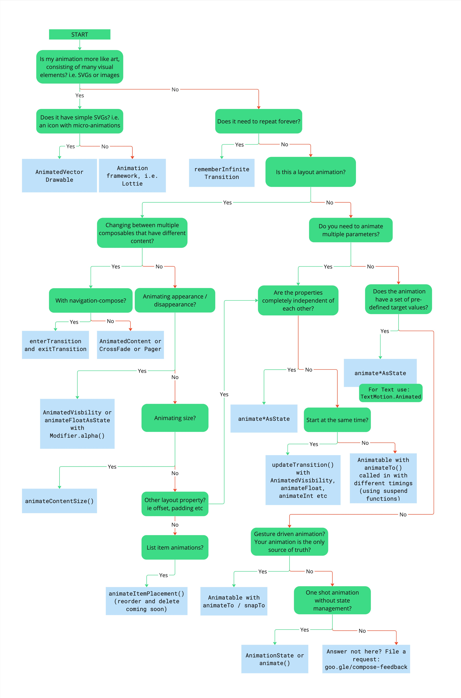
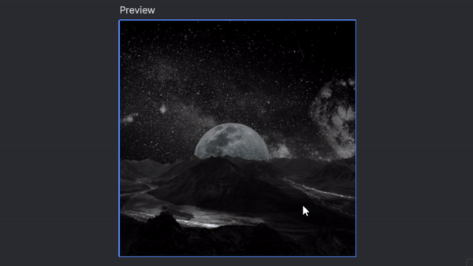
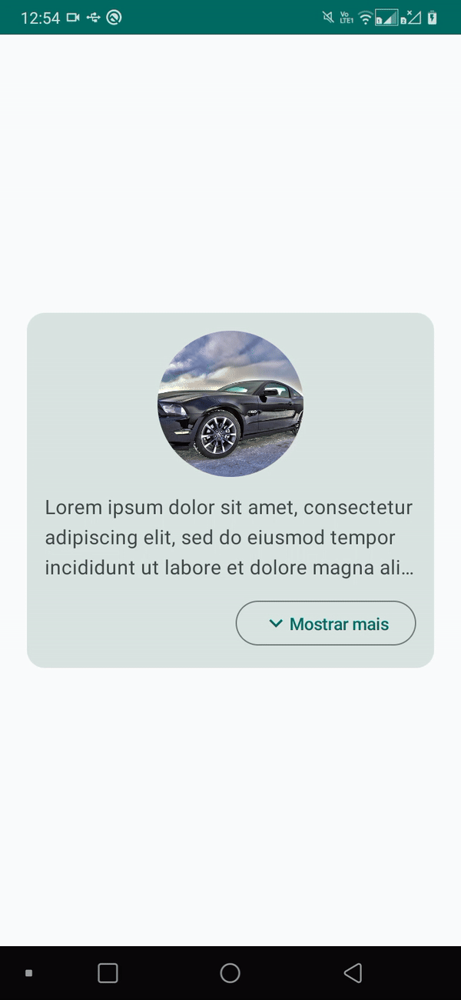
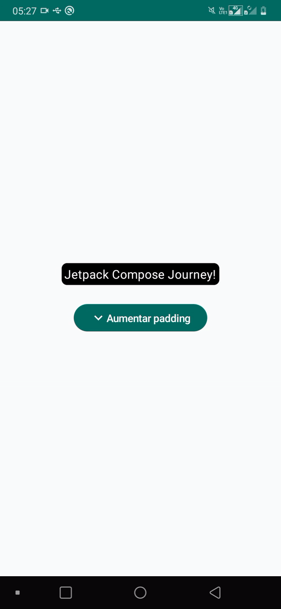
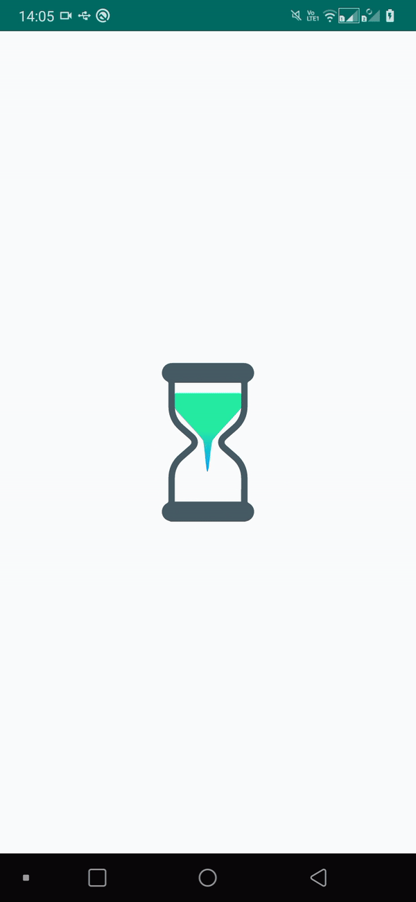

# Animações

Animações são fundamentais e deixam nossos apps com um visual mais interessante. Nessa seção veremos algumas das animações que podem ser usadas no Compose. Como existem várias e para múltiplos contextos diferentes, obviamente não veremos todas por aqui. A documentação é muito rica e possui diversos códigos de exemplo sobre animações, então isso não será um problema.

## Escolher a API de animação

Antes de começar a utilizar uma animação, é útil primeiro saber qual API utilizar para isso. A [documentação](https://developer.android.com/jetpack/compose/animation/choose-api) fornece um guia simples que você pode consultar rapidamente e ficar por dentro das principais opções e casos de uso. Abaixo temos um diagrama retirado da própria documentação para demonstrar isso.



## Animar Composable aparecendo/desaparecendo

Podemos usar a função **AnimatedVisibility()** para animar um Composable aparecendo/desaparecendo com facilidade. Veja o exemplo abaixo, ao invés de usarmos apenas um ```if (selected) {...}```, envolvemos nosso Composable **Icon()** na **AnimatedVisibility()**. Ela possui como argumento obrigatório **visible**, que é responsável por decidir se o conteúdo Composable passado nela será exibido ou não. Há também duas opções principais, **enter** e **exit**, responsáveis por decidir a animação de entrada e saída, que já possuem uma animação padrão. No nosso caso, substituímos pelas funções **scaleIn()** e **scaleOut()**, que funcionam bem nesse caso.

```kotlin
@Composable
private fun SelectableImage() {
    var selected by remember { mutableStateOf(false) }
    Box(
        contentAlignment = Alignment.Center,
        modifier = Modifier
            .size(200.dp)
            .clickable { selected = !selected },
    ) {
        Image(
            painter = painterResource(id = R.drawable.img_moon_space),
            contentDescription = "Image",
            contentScale = ContentScale.Crop,
            modifier = Modifier.fillMaxSize()
        )
        AnimatedVisibility(
            visible = selected,
            enter = scaleIn(),
            exit = scaleOut()
        ) {
            Icon(
                imageVector = Icons.Default.Done,
                contentDescription = null,
                tint = Color.White,
                modifier = Modifier
                    .size((60.dp))
                    .background(Color(0xFF0D47A1), CircleShape)
                    .padding(8.dp)
            )
        }
    }
}
```



## Alternar entre diferentes tipos de conteúdo

Às vezes, queremos que uma animação ocorra quando um conteúdo da tela muda, como por exemplo, baseado em estados diferentes, que geralmente são os casos de loading, sucesso e erro. Nós podemos fazer isso utilizando **AnimatedContent**. Ele possui um parâmetro **targetState** que é usado para definir o estado atual, e no lambda de retorno, o estado atual pode ser verificado para decidir que conteúdo exibir. Já **transitionSpec** é usado para definir a nossa animação, que nesse caso é apenas a junção da **scaleIn()** com **fadeOut()**, ambas com uma duração de 700 milissegundos. Já o **label** é usado aqui apenas para fins de propósito no Android Studio, para diferenciar as animações.

```kotlin
@Composable
fun ProfileScreen() {
    var state by remember { mutableStateOf(State.Loading) }
    AnimatedContent(
        targetState = state,
        transitionSpec = {
            scaleIn(
                animationSpec = tween(700)
            ) togetherWith fadeOut(animationSpec = tween(700))
        },
        label = "AnimatedContent",
        modifier = Modifier.clickable(
            interactionSource = remember { MutableInteractionSource() },
            indication = null
        ) {
            state = when (state) {
                State.Loading -> State.Success
                State.Success -> State.Error
                State.Error -> State.Loading
            }
        }
    ) { targetState ->
        when (targetState) {
            State.Loading -> {
                LoadingContent()
            }
            State.Success -> {
                ProfileContent()
            }
            State.Error -> {
                ErrorContent()
            }
        }
    }
}
```

<details>
  <summary>Ver restante do código</summary>
  
```kotlin
@Composable
private fun LoadingContent() {
    Column(
        verticalArrangement = Arrangement.Center,
        horizontalAlignment = Alignment.CenterHorizontally,
        modifier = Modifier
            .fillMaxSize()
    ) {
        CircularProgressIndicator()
        Spacer(Modifier.height(8.dp))
        Text(
            text = "Carregando perfil...",
            fontSize = 18.sp
        )
    }
}

@Composable
private fun ProfileContent() {
    Column(
        verticalArrangement = Arrangement.Center,
        horizontalAlignment = Alignment.CenterHorizontally,
        modifier = Modifier
            .fillMaxSize()
    ) {
        Image(
            painter = painterResource(id = R.drawable.img_nature),
            contentDescription = "Image",
            contentScale = ContentScale.Crop,
            modifier = Modifier
                .size(250.dp)
                .clip(RoundedCornerShape(16.dp))
        )
        Spacer(Modifier.height(8.dp))
        Text(
            text = "Informações carregadas com sucesso.",
            fontSize = 18.sp
        )
    }
}

@Composable
private fun ErrorContent() {
    Column(
        verticalArrangement = Arrangement.Center,
        horizontalAlignment = Alignment.CenterHorizontally,
        modifier = Modifier
            .fillMaxSize()
    ) {
        Icon(
            imageVector = Icons.Default.Info,
            contentDescription = null,
            modifier = Modifier
                .size(60.dp)
        )
        Spacer(Modifier.height(8.dp))
        Text(
            text = "Erro ao obter informações do perfil.",
            fontSize = 18.sp,
        )
    }
}

private enum class State {
    Loading,
    Success,
    Error
}
```
</details>


## Animar mudanças de tamanho de um Composable

O Compose fornece várias animações através de **Modifiers** e uma delas é o ```Modifier.animateContentSize()```, que serve para animar mudanças de tamanho de um Composable. Por exemplo, vamos criar um pequeno Card de informação com a opção "mostrar mais/menos" para o texto exibido. Adicionamos ```Modifier.animateContentSize(spring(dampingRatio = 3f))``` na Column pai do Text(). **animationSpec = spring(dampingRatio = 3f)** é adicionado apenas para ter uma animação mais legal, mas a animação padrão tem um **dampingRatio** com valor **1f**.

- A ordem dos modificadores é importante aqui. Certifique-se de colocar ```Modifier.animateContentSize()``` antes de qualquer modificador de tamanho, como ```Modifier.size()```.

```kotlin
@Composable
private fun InfoCard() {
    var expanded by remember { mutableStateOf(false) }
    Column(
        verticalArrangement = Arrangement.Center,
        horizontalAlignment = Alignment.CenterHorizontally,
        modifier = Modifier
            .fillMaxSize()
            .padding(24.dp)
    ) {
        Card(shape = RoundedCornerShape(16.dp)) {
            Column(
                modifier = Modifier
                    .animateContentSize(animationSpec = spring(dampingRatio = 3f))
                    .padding(12.dp)
            ) {
                Image(
                    painter = painterResource(id = R.drawable.img_car),
                    contentDescription = "Image",
                    contentScale = ContentScale.Crop,
                    modifier = Modifier
                        .size(150.dp)
                        .clip(RoundedCornerShape(16.dp))
                        .align(Alignment.CenterHorizontally)
                )
                Spacer(Modifier.height(12.dp))
                Text(
                    text = loremIpsumText,
                    maxLines = if (expanded) Int.MAX_VALUE else 3,
                    overflow = TextOverflow.Ellipsis
                )
                Spacer(Modifier.height(12.dp))
                OutlinedButton(
                    onClick = { expanded = !expanded },
                    modifier = Modifier.align(Alignment.End)
                ) {
                    Icon(
                        imageVector = if (expanded) Icons.Default.KeyboardArrowUp else Icons.Default.KeyboardArrowDown,
                        contentDescription = null
                    )
                    Text(
                        text = if (expanded) "Mostrar menos" else "Mostrar mais"
                    )
                }
            }
        }
    }
}

private const val loremIpsumText = "Lorem ipsum dolor sit amet, consectetur adipiscing elit, sed do" +
                " eiusmod tempor incididunt ut labore et dolore magna aliqua. Ut enim ad minim veniam, quis" +
                " nostrud exercitation ullamco laboris nisi ut aliquip ex ea commodo consequat. Duis aute" +
                " irure dolor in reprehenderit in voluptate velit esse cillum dolore eu fugiat nulla" +
                " pariatur. Excepteur sint occaecat cupidatat non proident, sunt in culpa qui officia" +
                " deserunt mollit anim id est laborum."
```



## Animar padding e rotação

Para animar as mudanças de padding e rotação de um Composable, você pode utilizar as funções ```animateDpAsState()``` e ```animateFloatAsState()```. Vamos ver um pequeno exemplo abaixo de como podemos fazer isso, animando o padding de um texto e a rotação de um ícone.

```kotlin
@Composable
private fun Info() {
    var expanded by remember { mutableStateOf(false) }
    val textPadding by animateDpAsState(
        targetValue = if (expanded) 14.dp else 4.dp,
        animationSpec = spring(
            dampingRatio = 3f,
            stiffness = Spring.StiffnessLow
        ),
        label = "textPadding"
    )
    val iconRotationAngle by animateFloatAsState(
        targetValue = if (expanded) 180f else 0f,
        animationSpec = spring(
            dampingRatio = 2f,
            stiffness = Spring.StiffnessMediumLow
        ),
        label = "iconRotationAngle"
    )
    Column(
        verticalArrangement = Arrangement.Center,
        horizontalAlignment = Alignment.CenterHorizontally,
        modifier = Modifier
            .fillMaxSize()
            .padding(24.dp)
    ) {
        Text(
            text = "Jetpack Compose Journey!",
            color = Color.White,
            modifier = Modifier
                .background(
                    color = Color.Black,
                    shape = RoundedCornerShape(8.dp)
                )
                .padding(textPadding)
        )
        Spacer(Modifier.height(24.dp))
        Button(onClick = { expanded = !expanded }) {
            Icon(
                imageVector = Icons.Default.KeyboardArrowDown,
                contentDescription = null,
                modifier = Modifier.rotate(iconRotationAngle)
            )
            Text(
                text = if (expanded) "Diminuir padding" else "Aumentar padding"
            )
        }
    }
}
```



Como pode ver, no caso do padding, usamos o ```Modifier.padding()``` no **Text()** como faríamos normalmente, mas dessa vez usando o valor de **animateDpAsState()**. No caso da rotação do ícone, usamos o ```Modifier.rotate()``` no **Icon()**, com o valor de **animateFloatAsState()**. Ambos utilizam um **targetValue** que varia dependendo do valor da variável **expanded**, além de uma **animationSpec** levemente personalizada.

## Bônus: Animações com Lottie

Além das animações padrão que o Compose fornece, também podemos utilizar animações com **Lottie**. Um Lottie é um formato de arquivo de animação baseado em JSON que permite enviar animações em qualquer plataforma com a mesma facilidade com que envia ativos estáticos. É um padrão já bem utilizado em apps com o sistema de Views/XML e outras plataformas. 

Vamos utilizar a biblioteca do [Lottie Compose](https://github.com/airbnb/lottie/blob/master/android-compose.md) para usar essas animações. Primeiro, adicione a dependência necessária no **build.gradle (app)**:

```gradle
dependencies {
    implementation("com.airbnb.android:lottie-compose:$version")
}
```

Vamos ver uma pequena implementação básica com uma animação de loading. Você pode baixar o arquivo de animação usado no exemplo abaixo [aqui](https://lottiefiles.com/animations/loading-sand-clock-YwwRRL2vx4) se desejar. Para baixar outras animações, acesse o [LottieFiles](https://lottiefiles.com/featured). Você deve colocar o arquivo **json** da animação na pasta **res/raw** do seu projeto.

```kotlin
@Composable
fun LoadingAnimation() {
    val composition by rememberLottieComposition(LottieCompositionSpec.RawRes(R.raw.loading_animation))
    val progress by animateLottieCompositionAsState(
        composition = composition,
        iterations = LottieConstants.IterateForever
    )
    Column(
        verticalArrangement = Arrangement.Center,
        horizontalAlignment = Alignment.CenterHorizontally,
        modifier = Modifier
            .fillMaxSize()
    ) {
        LottieAnimation(
            composition = composition,
            progress = { progress },
            modifier = Modifier.size(200.dp)
        )
    }
}
```



Como pode ver, é bem simples utilizar animações Lottie no Compose. Você pode conferir a [documentação da biblioteca](https://github.com/airbnb/lottie/blob/master/android-compose.md) para ver outros tipos de implementações.

## Conclusão

Animações com certeza dão um up a mais em qualquer app e conhecer algumas delas no Compose é essencial. Compose oferece muitos recursos e facilita muito o uso de animações, como você pôde ver nos exemplos acima. Não se esqueça de conferir a documentação para conhecer mais sobre animações no Compose.

## :link: Conteúdos auxiliares:
- [Quick guide to Animations in Compose (documentação)](https://developer.android.com/jetpack/compose/animation/quick-guide)
- [Animation modifiers and composables (documentação)](https://developer.android.com/jetpack/compose/animation/composables-modifiers)
- [Simple Animation with Jetpack Compose (codelab)](https://developer.android.com/codelabs/basic-android-kotlin-compose-woof-animation#0)