# Canvas e UI personalizada

Muitos aplicativos precisam ser capazes de controlar com precisão o que é desenhado na tela, seja algo pequeno como um círculo em um lugar específico da tela, ou um arranjo elaborado de elementos gráficos em muitos estilos diferentes. O Compose oferece 3 modificadores úteis para desenhar na tela e criar uma UI mais personalizada: ```Modifier.drawBehind()```, ```Modifier.drawWithContent()``` e ```Modifier.drawWithCache()```, cada um com suas particularidades. Além deles, também existe uma função Composable **Canvas()**, que por baixo dos panos é apenas um **Spacer()** com um ``Modifier.drawBehind()`` para ser utilizada de forma mais conveniente.

Todos os 3 modificadores expõem um **DrawScope**, que é um ambiente de desenho com escopo definido que mantém seu próprio estado. Isso permite definir os parâmetros para um grupo de elementos gráficos. O **DrawScope** fornece vários campos úteis, como **size**, um objeto **Size** que especifica as dimensões atuais do **DrawScope**.

Nos bastidores, o Compose depende do [Canvas baseado no sistema de Views e de outros objetos associados](https://developer.android.com/develop/ui/views/graphics/drawables). No entanto, o Compose simplifica muitos dos aspectos mais confusos do Canvas.

## Sistema de coordenadas

Para desenhar algo na tela, você precisa saber o deslocamento (**x** e **y**) e o tamanho do seu item. Para isso, você precisa entender o sistema de coordenadas do Compose. A origem do sistema de coordenadas ([0,0]) está no pixel superior esquerdo da área de desenho. **x** aumenta à medida que se move para a direita e **y** aumenta à medida que se move para baixo.

Todas as operações de desenho são realizadas usando o dimensionamento de pixels. Para garantir um dimensionamento consistente em diferentes densidades de dispositivos e tamanhos de tela, converta de **dp** usando a função **.toPx()** ou trabalhe em frações do tamanho.


## Desenhando formas básicas

Agora que já vimos um pouco da teoria, vamos à prática!

#### Desenhando retângulos

Vamos começar desenhando um retângulo com a função **drawRect()**:

```kotlin
@Composable
private fun Rect() {
    Canvas(
        modifier = Modifier
            .fillMaxSize()
    ) {
        val rectSize = 150.dp.toPx()
        drawRect(
            color = Color.Red,
            topLeft = Offset(0f, 0f),
            size = Size(rectSize, rectSize),
            style = Fill
        )
    }
}
```

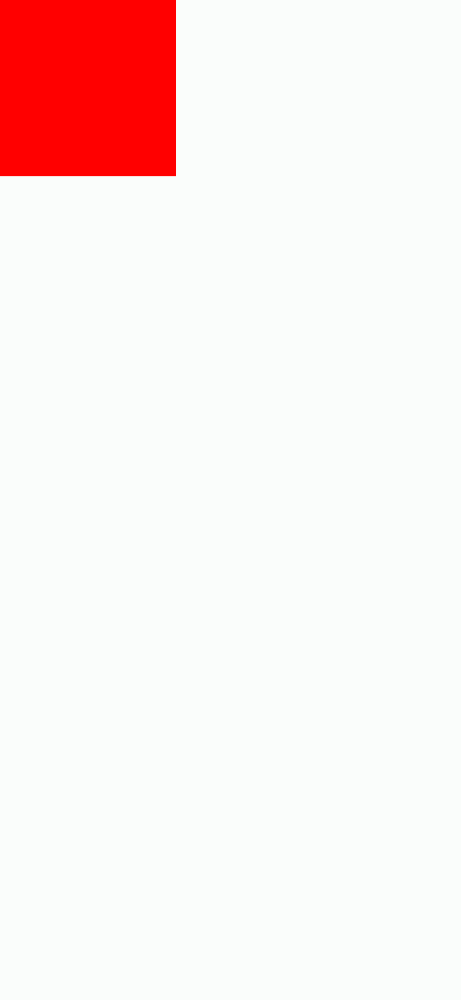

Alguns pontos importantes sobre os parâmetros da função **drawRect()**:

- **topLeft**: Representa a posição do retângulo. A maioria das funções de desenho têm valores padrão para a maioria dos parâmetros, e **drawRect()** tem o valor **Offset.Zero** para **topLeft**, que é o mesmo que **Offset(0f, 0f)** que utilizamos.
- **size**: O nome fala por si só. No nosso caso, estamos usando o mesmo tamanho para altura e largura, o que seria o equivalente a um quadrado.
- **style**: Representa o estilo do desenho, do tipo **DrawStyle**. **Fill** significa que toda a área será preenchida com a cor fornecida. A outra opção é **Stroke**, que desenha com um traço.

Também temos a função **drawRoundRect()**, que desenha um retângulo arredondado. Veja um exemplo de um retângulo com **style** do tipo **Stroke** e a função **drawRoundRect()** em ação:

```kotlin
@Composable
private fun Rect() {
    Canvas(
        modifier = Modifier
            .fillMaxSize()
    ) {
        val width = size.width
        val height = size.height

        val rectSize = 150.dp.toPx()
        drawRect(
            color = Color.Red,
            topLeft = Offset(
                x = (width - rectSize) / 2,
                y = (height - rectSize) / 2 - rectSize - (30.dp.toPx())
            ),
            size = Size(rectSize, rectSize),
            style = Stroke(width = 10.dp.toPx())
        )

        val corner = 24.dp.toPx()
        drawRoundRect(
            color = Color.Red,
            topLeft = Offset(
                x = (width - rectSize) / 2,
                y = (height - rectSize) / 2
            ),
            size = Size(rectSize, rectSize),
            style = Fill,
            cornerRadius = CornerRadius(x = corner, y = corner)
        )
    }
}
```

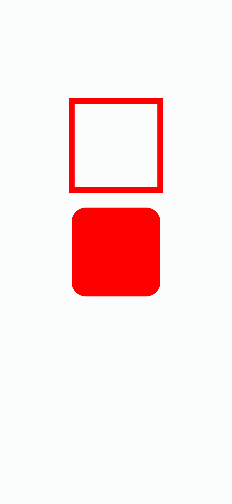

#### Desenhando círculos

Também temos a função **drawCircle()**, que desenha um círculo.

```kotlin
@Composable
private fun Circle() {
    Canvas(
        modifier = Modifier
            .fillMaxSize()
    ) {
        val circleRadius = 100.dp.toPx()
        drawCircle(
            color = Color.Blue,
            radius = circleRadius,
            center = Offset(center.x, center.y - circleRadius),
            style = Fill
        )
        drawCircle(
            color = Color.Blue,
            radius = circleRadius,
            center = Offset(center.x, center.y + (circleRadius + 20.dp.toPx())),
            style = Stroke(width = 10.dp.toPx())
        )
    }
}
```

- **radius**: O raio do círculo.
- **center**: A posição central do círculo.

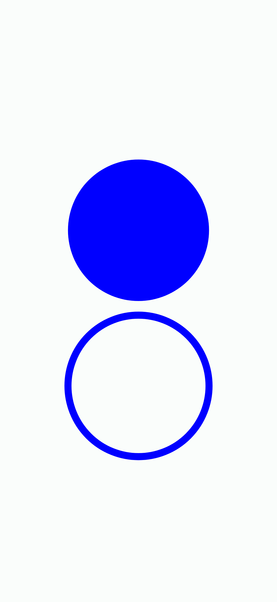

#### Desenhando arcos

Podemos desenhar arcos com a função **drawArc()**.

```kotlin
@Composable
private fun Arc1() {
    Canvas(
        modifier = Modifier
            .fillMaxSize()
    ) {
        val arcSize = 150.dp.toPx()
        drawArc(
            color = Color.Blue,
            startAngle = 0f,
            sweepAngle = 270f,
            topLeft = Offset(5.dp.toPx(), arcSize),
            size = Size(arcSize, arcSize),
            useCenter = true
        )
        drawArc(
            color = Color.Blue,
            startAngle = 0f,
            sweepAngle = 270f,
            topLeft = Offset(arcSize + 20.dp.toPx(), arcSize),
            size = Size(arcSize, arcSize),
            useCenter = false
        )

        drawArc(
            color = Color.Red,
            startAngle = 90f,
            sweepAngle = 180f,
            topLeft = Offset(5.dp.toPx(), (arcSize * 2) + 30.dp.toPx()),
            size = Size(arcSize, arcSize),
            useCenter = true,
            style = Stroke(width = 6.dp.toPx()),
        )
        drawArc(
            color = Color.Red,
            startAngle = 90f,
            sweepAngle = 180f,
            topLeft = Offset(arcSize + 20.dp.toPx(), (arcSize * 2) + 30.dp.toPx()),
            size = Size(arcSize, arcSize),
            useCenter = false,
            style = Stroke(width = 6.dp.toPx()),
        )
    }
}
```

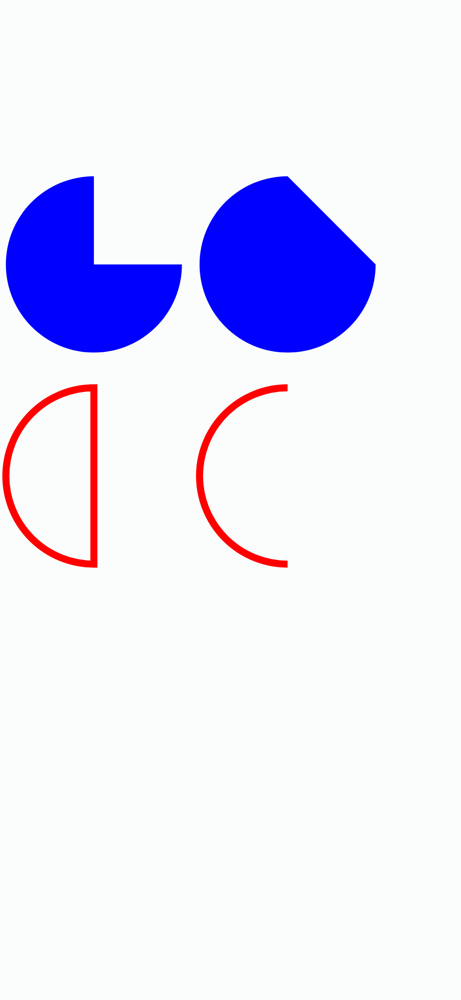

- **startAngle**: Ângulo inicial em graus.
- **sweepAngle**: Tamanho do arco em graus desenhado no sentido horário em relação a **startAngle**. 
- **useCenter**: Determina se o arco deve fechar o centro dos limites.
- **topLeft**: Um **Offset** que define a posição inicial (canto superior esquerdo) do retângulo que circunscreve o arco.

## Desenhando Paths

Um path é uma série de instruções matemáticas que resultam em um desenho, uma vez executado. Podemos desenhar um path usando a função **drawPath()**, que precisa de um objeto do tipo **Path** e alguns outros argumentos.

#### Desenhando um triângulo

Vamos ver um exemplo de um triângulo utilizando a função **drawPath()**. Veja o código:

```kotlin
@Composable
private fun Path() {
    Spacer(
        modifier = Modifier
            .drawWithCache {
                val path = Path().apply {
                    moveTo(x = 0f, y = size.height / 2)
                    lineTo(x = size.width / 2, y = 0f)
                    lineTo(x = size.width, y = size.height / 2)
                    close()
                }
                onDrawBehind {
                    drawPath(
                        path = path,
                        style = Fill,
                        color = Color.Red
                    )
                }
            }
            .fillMaxSize()
    )
}
```

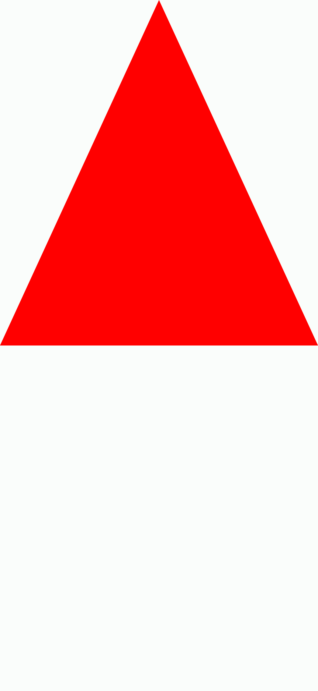

Vamos por partes. Dessa vez estamos utilizando a função **Modifier.drawWithCache()** em um **Spacer()**. Ela mantém os objetos criados dentro dela em cache. Os objetos são armazenados em cache desde que o tamanho da área de desenho seja o mesmo ou que quaisquer objetos de estado lidos não tenham sido alterados. Esse modificador é útil para melhorar o desempenho das chamadas de desenho, pois evita a necessidade de realocar objetos (como **Brush**, **Shader**, ***Path*** etc.) que são criados no desenho. Use **Modifier.drawWithCache()** apenas quando estiver criando objetos que devem ser armazenados em cache. Usar esse modificador sem a necessidade de armazenar objetos em cache pode resultar em alocações lambda desnecessárias.

Como última chamada, ela espera um **onDrawWithContent** ou **onDrawBehind**, que é o que estamos utilizando.

Agora vamos à explicação do **Path** criado:

- **moveTo(x = 0f, y = size.height / 2)**: Inicia um subpath com a coordenada indicada, ou seja, **x** e **y**. No nosso código, estamos "se movendo" para **0f** e **size.height / 2**, que significa o início da tela horizontalmente (**x = 0f**) e o centro da tela verticalmente (**size.height / 2**). Como dito antes, dentro de um **DrawScope** temos acesso a algumas propriedades, como **size**. Ou seja, **size.height** = tamanho em pixels desse **DrawScope**.

- **lineTo(x = size.width / 2, y = 0f)**: Adiciona um segmento de linha reta do ponto atual ao ponto determinado. No nosso código, o **ponto atual** é **(x = 0f, y = size.height / 2)**, como já definimos antes com **moveTo()**. Como usamos **lineTo(x = size.width / 2, y = 0f)**, criamos uma linha reta desse ponto atual até a coordenada indicada, ou seja, o centro da tela horizontalmente e o topo da tela verticalmente **(x = size.width / 2, y = 0f)**.

- **lineTo(x = size.width, y = size.height / 2)**: Como usamos **lineTo()** anteriormente, o nosso ponto atual agora é **(x = size.width / 2, y = 0f)**. Portanto, criamos uma linha desse ponto até o final da tela horizontalmente e o centro tela verticalmente **(x = size.width / 2, y = 0f)**.

- **close()**: Fecha o último subpath, como se uma linha reta tivesse sido desenhada do ponto atual até o primeiro ponto do subpath. Em resumo, usando **close()** no final criaremos uma linha do ponto atual **(x = size.width / 2, y = 0f)** até o primeiro subpath que criamos, que foi definido com o **moveTo(x = 0f, y = size.height / 2)**. Você não verá nenhuma grande diferença se estiver usando o **style** como **Fill**, mas se utilizar **Stroke**, poderá notar o que acontece mais claramente. Veja as imagens abaixo utilizando **style = Stroke(width = 8.dp.toPx())** com e sem **close()** no final.

<p align="center">
    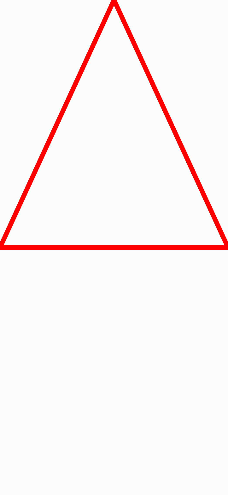
    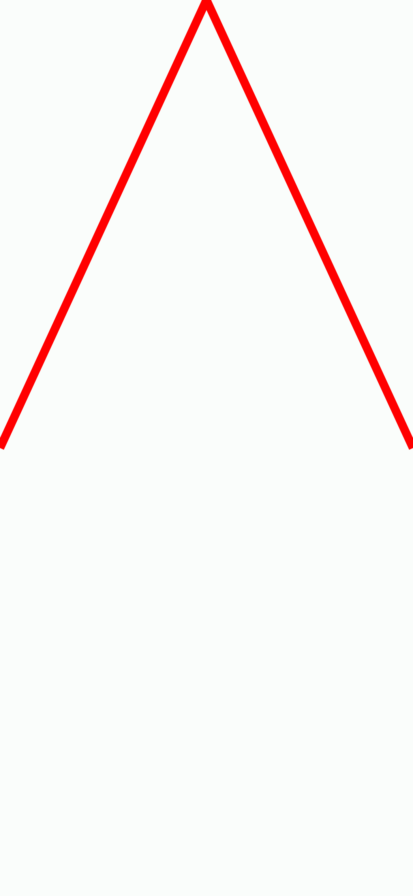
</p>

Veja a imagem abaixo para ver um exemplo mais visual do que foi dito acima:

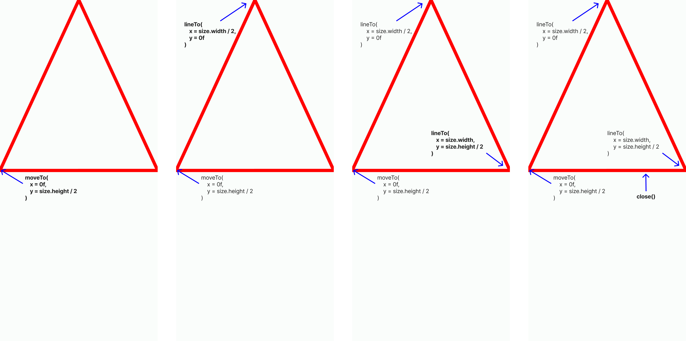

#### Desenhando uma curva de Bézier

Vamos usar a função **quadraticBezierTo()** para criar uma [curva de Bézier](https://pt.wikipedia.org/wiki/Curva_de_B%C3%A9zier). Veja o código:

```kotlin
@Composable
private fun Path2() {
    Spacer(
        modifier = Modifier
            .drawWithCache {
                val width = size.width
                val height = size.height
                val path = Path().apply {
                    moveTo(x = 0f, y = size.height / 2)
                    quadraticBezierTo(
                        x1 = size.width / 2,
                        y1 = 0f,
                        x2 = size.width,
                        y2 = size.height / 2
                    )
                    close()
                }
                onDrawBehind {
                    drawPath(
                        path = path,
                        style = Fill,
                        color = Color.Red
                    )
                }
            }
            .fillMaxSize()
    )
}
```

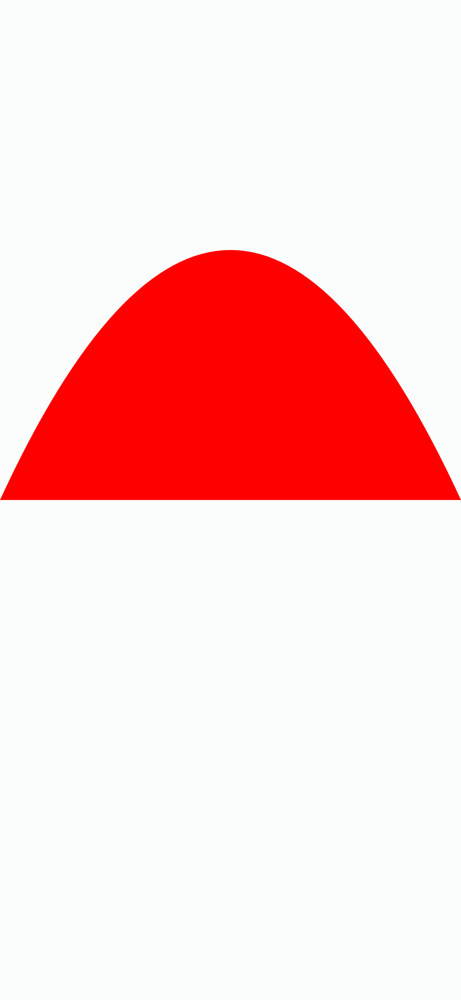

- **moveTo(x = 0f, y = size.height / 2)**: Já explicamos sobre essa função e estamos usando os exatos mesmos valores de antes.
- **quadraticBezierTo()**: Adiciona um segmento bézier quadrático que faz uma curva do ponto atual até o ponto determinado **(x2, y2)**, usando o ponto de controle **(x1, y1)**. Olhando para o nosso código, o ponto atual é **(x = 0f, y = size.height / 2)**, ou seja, o início da tela horizontalmente e o centro da tela verticalmente. A curva que criamos vai do ponto atual até a coordenada **x2 = size.width** e **y2 = size.height / 2**, que significa o fim da tela horizontalmente e o centro da tela verticalmente. Já os valores **x1 = size.width / 2** e **y1 = 0f** são usados para criar o ponto de controle da curva, em outras palavras, aplicar o efeito na curva. Com os valores fornecidos, é o centro da tela horizontalmente e o início da tela verticalmente (o centro no topo). O **close()** segue o mesmo princípio que já falamos antes.

Veja a imagem abaixo para ver um exemplo mais visual do que foi dito acima:

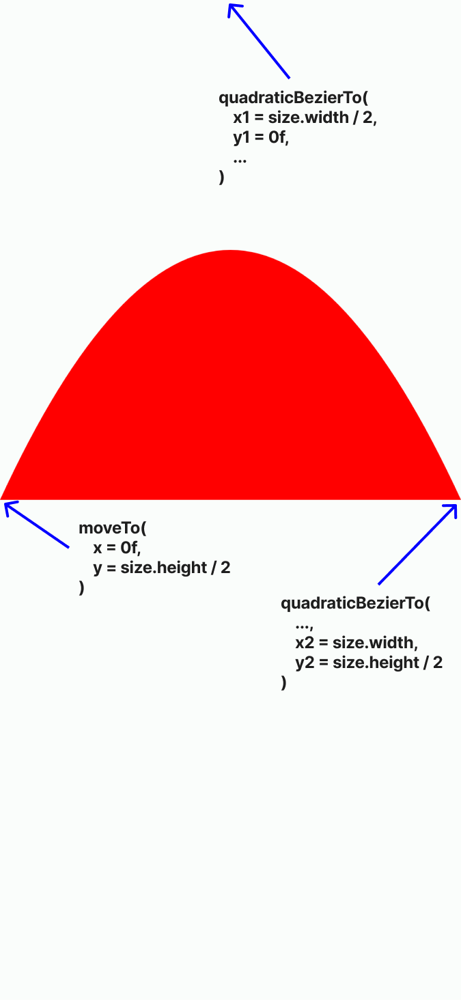

```kotlin
@Composable
private fun Path() {
    Spacer(
        modifier = Modifier
            .drawWithCache {
                val path = Path().apply {
                    moveTo(x = 0f, y = size.height / 2)
                    quadraticBezierTo(
                        x1 = 30.dp.toPx(),
                        y1 = 0f,
                        x2 = size.width,
                        y2 = size.height / 2
                    )
                }
                onDrawBehind {
                    drawPath(
                        path = path,
                        style = Stroke(width = 8.dp.toPx()),
                        color = Color.Red
                    )
                }
            }
            .fillMaxSize()
    )
}
```

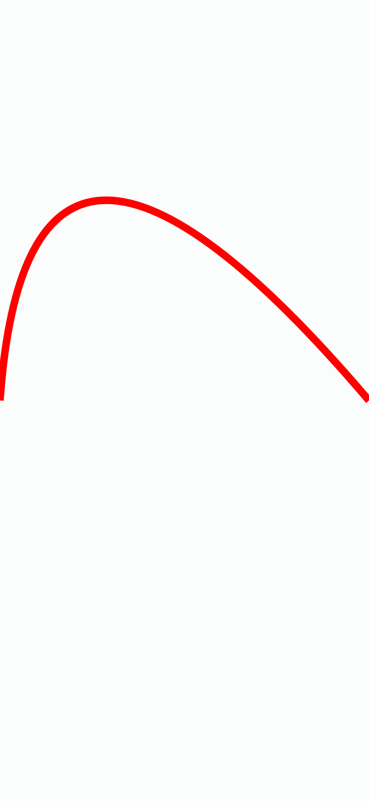

## Desenhando sobre o conteúdo

Já vimos o uso da ```Modifier.drawBehind()``` e ```Modifier.drawWithCache()```, agora veremos a ```Modifier.drawWithContent()``` em prática. A ```Modifier.drawWithContent()``` permite executar operações **DrawScope** antes ou depois do conteúdo do Composable. É necessário chamar a função **drawContent()** para renderizar o conteúdo Composable, caso contrário ele não será desenhado. Você pode escolher a ordem de chamada dele, influenciando na UI final.

Veja o exemplo abaixo, com 2 **Text()**. No primeiro, o retângulo é desenhado antes do conteúdo do **Text()** (o texto em si, nesse caso), pois chamamos **drawContent()** antes da operação de desenho **drawRect()**. Já no segundo **Text()**, o retângulo é desenhado por trás, pois chamamos **drawContent()** depois de **drawRect()**.

```kotlin
@Composable
private fun DrawWithContent() {
    Column(modifier = Modifier.padding(12.dp)) {
        Text(
            text = "Jetpack Compose Journey",
            color = Color.Black,
            fontSize = 24.sp,
            modifier = Modifier.drawWithContent {
                drawContent()
                drawRect(
                    color = Color.Red,
                    topLeft = Offset(x = 0f, y = size.height / 2),
                    size = Size(width = size.width, height = 5.dp.toPx()),
                    style = Fill
                )
            }
        )
        Spacer(Modifier.height(12.dp))
        Text(
            text = "Jetpack Compose Journey",
            color = Color.Black,
            fontSize = 24.sp,
            modifier = Modifier.drawWithContent {
                drawRect(
                    color = Color.Red,
                    topLeft = Offset(x = 0f, y = size.height / 2),
                    size = Size(width = size.width, height = 5.dp.toPx()),
                    style = Fill
                )
                drawContent()
            }
        )
    }
}
```

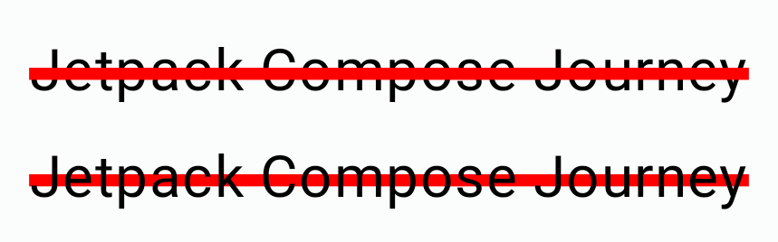

## Tela de Login com decorações

Para não ficar apenas em desenhos simples de exemplos, vamos criar uma tela de login com algumas pequenas decorações utilizando funções como **drawCircle()** e **drawPath()**. Antes de tudo, vamos criar uma **extension function** para desenhar as decorações. Pouparei as explicações sobre ela, pois já vimos tudo ao longo dessa seção.

```kotlin
private fun DrawScope.drawDecoration(color: Color) {
    drawCircle(
        color = color,
        radius = 150.dp.toPx(),
        center = Offset(x = 0f, y = 0f),
        style = Fill
    )
    drawCircle(
        color = color,
        radius = 120.dp.toPx(),
        center = Offset(x = 120.dp.toPx(), y = -30.dp.toPx()),
        style = Fill
    )

    val path = Path().apply {
        moveTo(x = 0f, y = size.height)
        quadraticBezierTo(
            x1 = size.width / 2,
            y1 = size.height - 150.dp.toPx(),
            x2 = size.width,
            y2 = size.height
        )
        close()
    }
    drawPath(
        path = path,
        color = color,
        style = Fill
    )
}
```

Agora vamos criar a **LoginScreen** de exemplo, utilizando ```Modifier.drawBehind()``` com a nossa **drawDecoration()**.

```kotlin
@Composable
fun LoginScreen() {
    var email by remember { mutableStateOf("") }
    var password by remember { mutableStateOf("") }
    val decorationColor = MaterialTheme.colorScheme.primary
    Column(
        verticalArrangement = Arrangement.Center,
        horizontalAlignment = Alignment.CenterHorizontally,
        modifier = Modifier
            .fillMaxSize()
            .drawBehind {
                drawDecoration(color = decorationColor)
            }
            .padding(26.dp)
    ) {
        Text(
            text = "Login",
            fontSize = 42.sp,
            fontWeight = FontWeight.Bold
        )
        Spacer(Modifier.height(24.dp))
        OutlinedTextField(
            value = email,
            onValueChange = { email = it },
            label = {
                Text(text = "E-mail")
            },
            leadingIcon = {
                Icon(
                    imageVector = Icons.Default.Email,
                    contentDescription = null
                )
            },
            shape = CircleShape,
            modifier = Modifier.fillMaxWidth()
        )
        Spacer(Modifier.height(12.dp))
        OutlinedTextField(
            value = password,
            onValueChange = { password = it },
            label = {
                Text(text = "Senha")
            },
            leadingIcon = {
                Icon(
                    imageVector = Icons.Default.Lock,
                    contentDescription = null
                )
            },
            shape = CircleShape,
            modifier = Modifier.fillMaxWidth()
        )
        Spacer(Modifier.height(18.dp))
        Button(
            onClick = {},
            contentPadding = PaddingValues(16.dp),
            modifier = Modifier.fillMaxWidth()
        ) {
            Text(text = "Login")
        }
    }
}
```

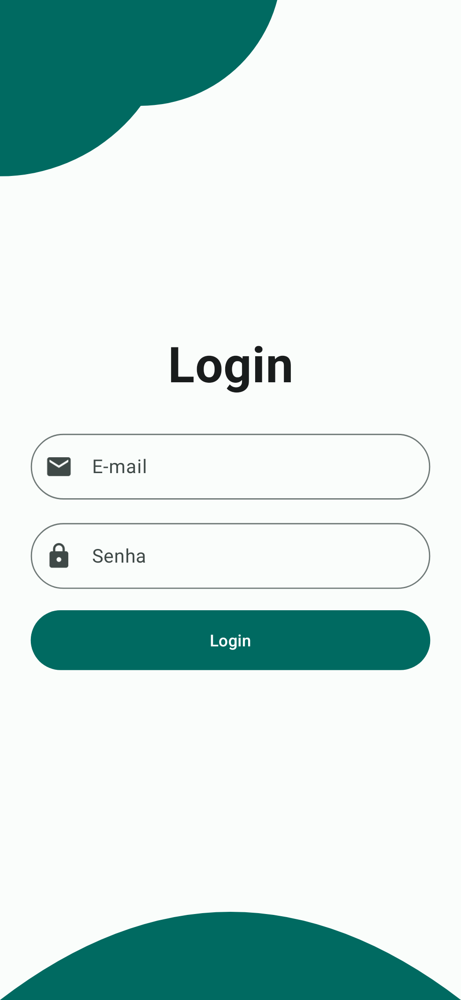

Como é possível observar, as decorações dão um visual mais interessante à tela.

## Conclusão

**Canvas** é uma ferramenta muito poderosa e entender sua utilização é importante para criar componentes e uma UI mais personalizada. Assim como praticamente tudo em relação ao XML, Compose simplifica muito o desenho na tela com **Canvas**, como foi possível ver ao longo dessa seção. Você pode ler mais na documentação para descobrir algumas outras funcionalidades que não foram abordadas aqui, como por exemplo, [**transformações básicas**](https://developer.android.com/jetpack/compose/graphics/draw/overview#basic-transformations).

## :link: Conteúdos auxiliares:
- [Graphics in Compose (documentação)](https://developer.android.com/jetpack/compose/graphics/draw/overview)
- [Easing in to Easing Curves in Jetpack Compose (artigo)](https://medium.com/androiddevelopers/easing-in-to-easing-curves-in-jetpack-compose-d72893eeeb4d)
- [How to Draw an Arc in Jetpack Compose Canvas (artigo)](https://semicolonspace.com/draw-arc-jetpack-compose-canvas)
- [Jetpack Compose Canvas (artigo)](https://medium.com/falabellatechnology/jetpack-compose-canvas-8aee73eab393)
- [Creating a Custom Microsoft Icon with Jetpack Compose (artigo)](https://medium.com/@esthcarelle/creating-a-custom-microsoft-icon-with-jetpack-compose-ddf3df088688)