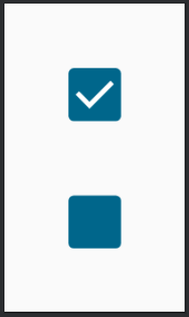

# Checkbox

Checkbox segue praticamente o mesmo mecanismo de **Switch**, então não há muito o que falar sobre ele. Para evitar alongar a seção, evitarei exemplos com cores e personalização, mas assim como vimos no **Switch**, podemos alterar cores.

```kotlin
@Composable
private fun Checkbox() {
    var checked by remember { mutableStateOf(true) }
    Checkbox(
        checked = checked,
        onCheckedChange = { isChecked ->
            checked = isChecked
        }
    )
}
```



## :link: Conteúdos auxiliares:
- [Checkbox (Material Design 3)](https://m3.material.io/components/checkbox/overview)