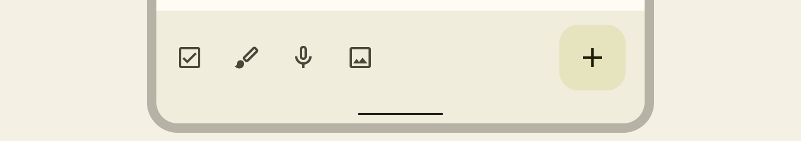

# Scaffold

Essa seção é dedicada a componentes que estão mais a níveis de tela do que os abordados na parte 1. Começaremos com Scaffold, que é um dos principais.

Scaffold é uma estrutura fundamental que fornece um meio padronizado para interfaces complexas. Ele também fornece uma API simples que você pode usar para montar rapidamente a estrutura do seu app de acordo com as diretrizes do Material Design. Scaffold aceita vários Composables como parâmetros, entre estes estão os seguintes:

- **topBar**: a barra de aplicativos na parte superior da tela.
- **bottomBar**: a barra de aplicativos na parte inferior da tela, que também pode ser uma **barra de navegação**;
- **floatingActionButton**: um botão que paira sobre o canto inferior direito da tela que você pode usar para expor as principais ações.

Veja um pequeno exemplo de um **Scaffold**:

```kotlin
@Composable
private fun Scaffold() {
    Scaffold(
        topBar = {
            TopAppBar(
                colors = topAppBarColors(
                    containerColor = MaterialTheme.colorScheme.primaryContainer,
                    titleContentColor = MaterialTheme.colorScheme.primary,
                ),
                title = {
                    Text("TopAppBar")
                }
            )
        },
        bottomBar = {
            BottomAppBar(
                containerColor = MaterialTheme.colorScheme.primaryContainer,
                contentColor = MaterialTheme.colorScheme.primary,
            ) {
                Text(
                    text = "BottomAppBar",
                    textAlign = TextAlign.Center,
                    modifier = Modifier
                        .fillMaxWidth()
                )
            }
        },
        floatingActionButton = {
            FloatingActionButton(onClick = {}) {
                Icon(
                    imageVector = Icons.Default.Add,
                    contentDescription = "Add"
                )
            }
        }
    ) { innerPadding ->
        Column(
            verticalArrangement = Arrangement.Center,
            horizontalAlignment = Alignment.CenterHorizontally,
            modifier = Modifier
                .padding(innerPadding)
                .fillMaxSize()
        ) {
            Text(
                text = "Conteúdo da tela",
                fontSize = 24.sp
            )
        }
    }
}
```


## PaddingValues

Scaffold expõe um **PaddingValues** que deve ser usado no Composable do **content**, que no código acima está sendo nomeado como **innerPadding** e usado pela **Column**. Se não usarmos ele, a tela pode ficar inconsistente. Você pode ler [esse artigo](https://blog.stackademic.com/scaffolds-paddingvalues-in-jetpack-compose-1bacb0341c08) e/ou [esse](https://medium.com/jetpack-composers/what-does-the-paddingvalues-parameter-in-a-compose-scaffold-do-3bd5592b9c6b) para ver exemplos visuais e saber um pouco mais sobre isso.

## Parâmetro bottomBar

O parâmetro **bottomBar** pode ser usado tanto para criar uma [BottomAppBar](https://m3.material.io/components/bottom-app-bar/overview) quanto uma [NavigationBar](https://m3.material.io/components/navigation-bar/overview). Veja as imagens de exemplo abaixo de uma **BottomAppBar** e **NavigationBar**, respectivamente, retiradas diretamente do site do Material Design 3.




## :link: Conteúdos auxiliares:
- [Scaffold (documentação)](https://developer.android.com/jetpack/compose/components/scaffold)