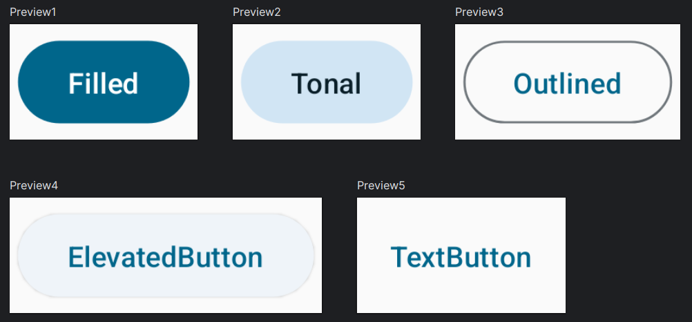
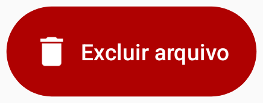

# Button

Botões também são uma parte fundamental em qualquer app. No Jetpack Compose nós temos várias opções de botões para se utilizar. Para evitar deixar essa seção longa, você pode ler a descrição de cada botão na [documentação](https://developer.android.com/jetpack/compose/components/button).

A implementação básica de um **Button** segue o código abaixo:

```kotlin
@Composable
private fun Button() {
    Button(onClick = {}) {
        Text("Button")
    }
}
```

Você pode alterar o nome **Button** no código acima para qualquer uma das seguintes opções: ***FilledTonalButton***, ***OutlinedButton***, ***ElevatedButton*** ou ***TextButton***. O resultado você vê logo abaixo, onde ***Filled*** é a implementação básica mostrada no código anterior.



Obviamente, você tem diversas opções de customização do **Button**. Veja um pequeno exemplo modificando o **contentPadding** e a **containerColor**, além de um ícone ao lado do texto:

```kotlin
@Composable
private fun CustomButton() {
    Button(
        onClick = {},
        contentPadding = PaddingValues(16.dp),
        colors = ButtonDefaults.buttonColors(
            containerColor = Color(0xFFAF0101)
        )
    ) {
        Icon(
            imageVector = Icons.Default.Delete,
            contentDescription = "Delete icon"
        )
        Spacer(Modifier.width(6.dp))
        Text("Excluir arquivo")
    }
}
```



- Não precisamos especificar uma **Row** para obter o efeito do **Icon()** estar ao lado do **Text()** porque o **content** (o último parâmetro) que o **Button** espera já é uma ***RowScope***, ou seja, é como se estivéssemos dentro de uma **Row** por padrão.

## :link: Conteúdos auxiliares:
- [Button (documentação)](https://developer.android.com/jetpack/compose/components/button)
- [Buttons (Material Design 3)](https://m3.material.io/components/buttons/overview)