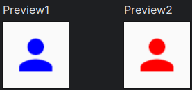
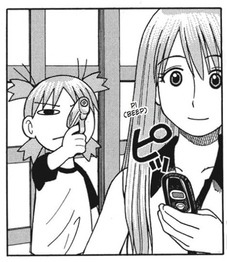
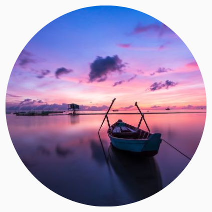
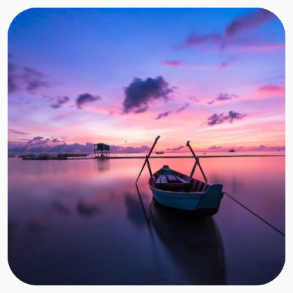
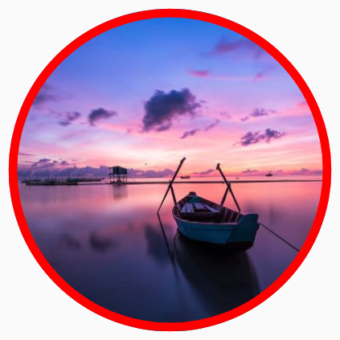
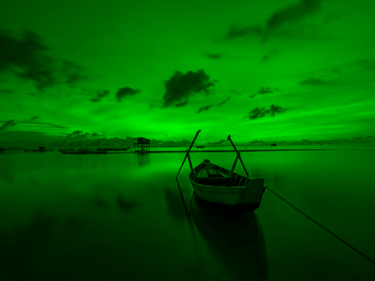

# Image

Praticamente todo app tem imagens. Essa seção abordará um pouco sobre como utilizar imagens no Compose, bem como algumas pequenas personalizações.

## Icon

Antes de falarmos sobre o componente **Image()**, vamos falar sobre o [Icon()](https://developer.android.com/jetpack/compose/graphics/images/material). Você pode obter o mesmo comportamento usando **Image()**, mas **Icon()** é uma forma mais conveniente para carregar ícones, como drawables vetoriais. Isso porque ele fornece um parâmetro **tint** que pode ser usado para mudar a cor do ícone facilmente. Já usamos ele em seções anteriores, mas vamos ver mais um exemplo.

Compose possui alguns ícones padrão fornecido através de **Icons**, como por exemplo: ```Icons.Default.Delete```. Você pode usar ícones tanto com ***imageVector*** quanto ***painter***, como no exemplo abaixo, que utiliza um ícone de **Icons** e um ícone criado com o [**Asset Studio**](https://developer.android.com/studio/write/create-app-icons) do **Android Studio**:

```kotlin
@Composable
private fun Icon1() {
    Icon(
        imageVector = Icons.Default.Person,
        contentDescription = "Person icon",
        tint = Color.Blue
    )
}

@Composable
private fun Icon2() {
    Icon(
        painter = painterResource(id = R.drawable.baseline_person_24),
        contentDescription = "Person icon",
        tint = Color.Red
    )
}
```



## Carregando imagens locais

Vamos começar carregando imagens que estão na pasta ***res/drawable***. Veja o exemplo simples:

```kotlin
@Composable
private fun Image() {
    Box(
        contentAlignment = Alignment.Center,
        modifier = Modifier.fillMaxSize()
    ) {
        Image(
            painter = painterResource(id = R.drawable.img_nature),
            contentDescription = "Image",
            contentScale = ContentScale.Crop,
            modifier = Modifier.size(width = 300.dp, height = 250.dp)
        )
    }
}
```


Adicionamos um ```ContentScale.Crop``` e mudamos o tamanho da imagem com o ```Modifier.size(width = 300.dp, height = 250.dp)```. Veja a [documentação](https://developer.android.com/jetpack/compose/graphics/images/customize#content-scale) para ter mais noção sobre o **ContentScale** e como ele modifica a exibição da imagem.

## Carregando imagens da internet

Assim como no sistema View, Compose não oferece uma maneira nativa de carregar imagens da internet. Precisamos utilizar bibliotecas de terceiros. Existem várias opções, como [Coil](https://github.com/coil-kt/coil), [Glide](https://github.com/bumptech/glide) e também a [Landscapist](https://github.com/skydoves/landscapist), que oferece opções de carregamento usando as duas anteriores. Particularmente, costumo utilizar muito a **Landscapist**, pois ela oferece diversas opções de personalização interessantes. Mas vamos ver um exemplo utilizando a **Coil**, que é bastante popular. Primeiro temos que adicionar sua dependência:

```gradle
implementation("io.coil-kt:coil-compose:$version")
```

Lembre-se também de adicionar a permissão de acesso à internet no **AndroidManifest**:

```xml
<uses-permission android:name="android.permission.INTERNET" />
```

```kotlin
@Composable
private fun Image() {
    AsyncImage(
        model = "https://...",
        contentDescription = "Image"
    )
}
```



## Customizando images

Você também pode personalizar a exibição da imagem. Por exemplo, tornando ela circular ou com um shape personalizado. Basta utilizar o poder do ```Modifier.clip()```. Essa função não é do componente **Image()** em si, mas pode ser aplicada em qualquer Composable (quando fizer sentido, claro). Vamos ver mais sobre o **Modifier** em sua própria seção.

=== "CircleShape"

    

    ```kotlin
    @Composable
    private fun Image() {
        Image(
            painter = painterResource(id = R.drawable.img_nature),
            contentDescription = "Image",
            contentScale = ContentScale.Crop,
            modifier = Modifier
                .size(150.dp)
                .clip(CircleShape)
        )
    }
    ```

=== "RoundedCornerShape(16.dp)"

    

    ```kotlin
    @Composable
    private fun Image() {
        Image(
            ...
            modifier = Modifier
                .size(150.dp)
                .clip(RoundedCornerShape(16.dp))
        )
    }
    ```

=== "CircleShape com borda"

    

    ```kotlin
    @Composable
    private fun Image() {
        val borderWidth = 4.dp
        Image(
            painter = painterResource(id = R.drawable.img_nature),
            contentDescription = "Image",
            contentScale = ContentScale.Crop,
            modifier = Modifier
                .size(150.dp)
                .border(
                    border = BorderStroke(borderWidth, Color.Red),
                    shape = CircleShape
                )
                .clip(CircleShape)
        )
    }
    ```

Podemos adicionar também um **colorFilter**:

```kotlin
@Composable
private fun Image() {
    Image(
        painter = painterResource(id = R.drawable.img_nature),
        contentDescription = "Image",
        contentScale = ContentScale.Crop,
        colorFilter = ColorFilter.tint(color = Color.Green, blendMode = BlendMode.Darken),
        modifier = Modifier.size(width = 200.dp, height = 150.dp)
    )
}
```



## :link: Conteúdos auxiliares:
- [Customize an image (documentação)](https://developer.android.com/jetpack/compose/graphics/images/customize)