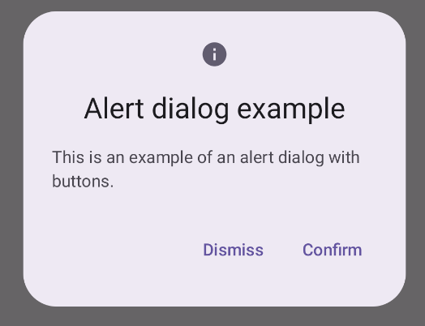
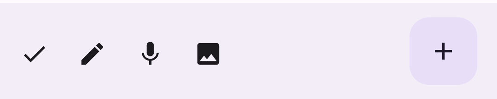
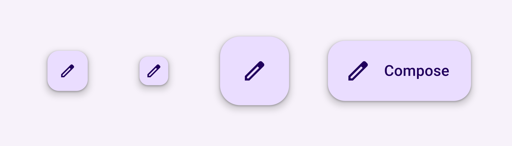
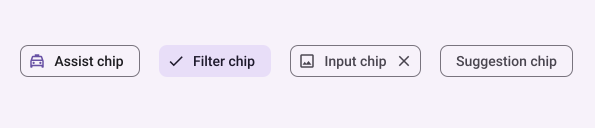

# Outros componentes

Para evitar deixar essa seção longa demais e como existem diversos outros componentes, vou apenas citar o nome de mais alguns. A documentação é bem rica e possui detalhes de como implementar cada um deles. Os componentes mostrados anteriormente são importantes e devem te dar uma boa base de como os outros funcionam no Compose.

As imagens usadas aqui também são da própria documentação de cada componente.

## AlertDialog

AlertDialogs são fundamentais em qualquer aplicativo e o Compose também oferece esse componente com fácil utilização. Além do componente tradicional do M3, você também tem acesso ao componente [**Dialog**](https://developer.android.com/jetpack/compose/components/dialog#dialog-composable), que pode ser usado para criar dialogs mais personalizados sem estar preso aos paddings/diretrizes que o **AlertDialog** tradicional possui. Confira na [documentação](https://developer.android.com/jetpack/compose/components/dialog).

## TopAppBar e BottomAppBar

TopAppBar também é um componente essencial. Compose oferece diversas opções para se utilizar, como ***CenterAlignedTopAppBar***, além de opções de [comportamento de rolagem](https://developer.android.com/jetpack/compose/components/app-bars#scroll).

Ele é comumente utilizado com o componente **Scaffold** e também existe a versão inversa do TopAppBar, o **BottomAppBar**. Nas imagens abaixo você vê exemplos de um **TopAppBar** e **BottomAppBar**, respectivamente. Confira na [documentação](https://developer.android.com/jetpack/compose/components/app-bars).

## Pager

Pager é um componente que oferece a função de paginação de Composables, bem comum em visualizadores de imagens, por exemplo. Ele é semelhante ao **ViewPager** do XML. Existem as opções de ***HorizontalPager*** e ***VerticalPager***, onde o nome já sugere bem o que cada um faz. Confira na [documentação](https://developer.android.com/jetpack/compose/layouts/pager).

## Floating Action Button

Floating Action Button (FAB) é um componente bem conhecido. Ele também é comumente utilizado junto do **Scaffold**. Confira na [documentação](https://developer.android.com/jetpack/compose/components/fab).

## Progress

Progress é um componente bastante comum e utilizado. Confira na [documentação](https://developer.android.com/jetpack/compose/components/progress).

## Chip

Chip também é um componente bem comum. Confira na [documentação](https://developer.android.com/jetpack/compose/components/chip).

## Conclusão

Há vários outros componentes que não foram citados e você pode conferir na [documentação do pacote do Material Design 3 do Compose](https://developer.android.com/reference/kotlin/androidx/compose/material3/package-summary). Alguns outros componentes também muito utilizados e que vale a pena mencionar são o **NavigationBar**, **RadioButton** e **DropdownMenu**. Como nenhum deles possuem uma página dedicada na seção de componentes da documentação como os mencionados acima, evitei colocá-los sem uma referência "oficial", mas todos eles estão presentes na documentação do pacote do MD3 do Compose, incluindo alguns exemplos de implementação e imagens.