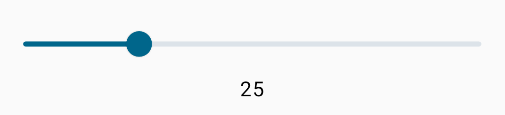
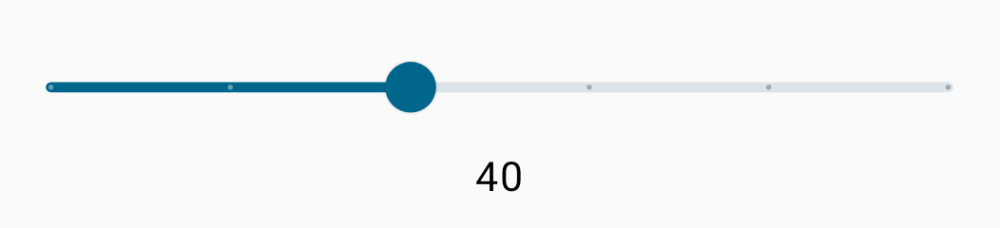
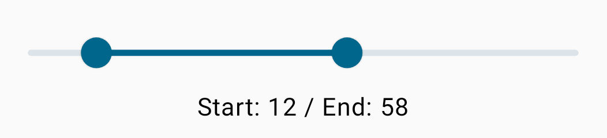

# Slider

Slider é um componente importante para usarmos quando precisamos de seleções em um intervalo de valores.

Vamos ver uma implementação básica abaixo, com um **valueRange** entre 0 e 100. ```roundToInt()``` está sendo usado no Text() para arredondar o valor do **sliderPosition** para um número mais amigável, caso contrário teríamos algo como **25.2683...**, o que não é o que queremos no exemplo.

```kotlin
@Composable
private fun Slider() {
    var sliderPosition by remember { mutableFloatStateOf(0f) }
    Column {
        Slider(
            value = sliderPosition,
            onValueChange = { position ->
                sliderPosition = position
            },
            valueRange = 0f..100f
        )
        Text(
            text = sliderPosition.roundToInt().toString(),
            modifier = Modifier.align(Alignment.CenterHorizontally)
        )
    }
}
```



Também temos a opção de **steps**, que é útil para o usuário selecionar valores entre etapas rapidamente. Por exemplo:

```kotlin
@Composable
private fun Slider() {
    var sliderPosition by remember { mutableFloatStateOf(0f) }
    Column {
        Slider(
            ...
            steps = 4
        )
        ...
    }
}
```



Também temos uma outra opção de Slider: ***RangeSlider***. A diferença nele é que o usuário pode selecionar 2 valores entre intervalos.

```kotlin
@Composable
private fun RangeSlider() {
    var sliderPosition by remember { mutableStateOf(0f..100f) }
    Column {
        RangeSlider(
            value = sliderPosition,
            onValueChange = { position ->
                sliderPosition = position
            },
            valueRange = 0f..100f
        )
        Text(
            text = "Start: ${sliderPosition.start.roundToInt()} / End: ${sliderPosition.endInclusive.roundToInt()}",
            modifier = Modifier.align(Alignment.CenterHorizontally)
        )
    }
}
```



Ambos têm outras propriedades úteis, como a **colors** para modificar as cores e **onValueChangeFinished**, que é acionada quando o usuário finaliza a seleção. Podemos usar **onValueChangeFinished** para chamar alguma lógica de negócio ou algo do tipo.

## :link: Conteúdos auxiliares:
- [Slider (documentação)](https://developer.android.com/jetpack/compose/components/slider)
- [Sliders (Material Design 3)](https://m3.material.io/components/sliders/overview)