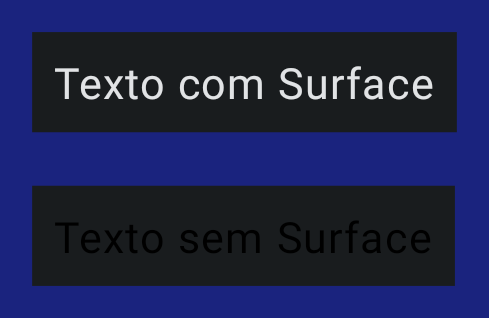
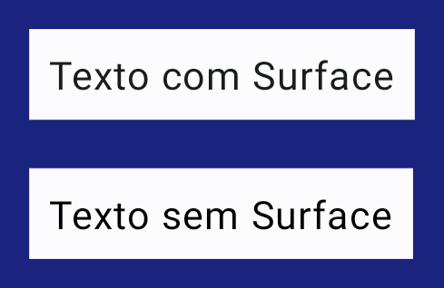

# Surface

**Surface** é um dos primeiros componentes que temos contato, já que ele está presente no **onCreate()** da **MainActivity** ao criarmos um projeto Compose. Ele fornece uma superfície de Material Design com alguns parâmetros que podem ser usados para definir cor, borda, elevação, shape etc. Cada superfície existe em uma determinada elevação, o que influencia como esse pedaço de superfície se relaciona visualmente com outras superfícies e como essa superfície é modificada pela variação tonal.

## Surface e cores

Vamos ver um pequeno exemplo prático de como o **Surface** pode influenciar em propriedades de seus componentes filhos, como cores. O código abaixo possui 2 textos iguais com um elemento pai definindo a cor de fundo como ```MaterialTheme.colorScheme.background```. Estamos usando **Box** no segundo exemplo, porém poderia ser qualquer outro tipo de layout.

```kotlin
@Composable
private fun Surface() {
    Column(
        modifier = Modifier
            .background(Color(0xFF1A237E))
            .padding(12.dp)
    ) {
        Surface(color = MaterialTheme.colorScheme.background) {
            Text(
                text = "Texto com Surface",
                modifier = Modifier.padding(8.dp)
            )
        }
        Spacer(Modifier.height(20.dp))
        Box(modifier = Modifier.background(MaterialTheme.colorScheme.background)) {
            Text(
                text = "Texto sem Surface",
                modifier = Modifier.padding(8.dp)
            )
        }
    }
}
```

Agora, dependendo do tema atual (dark ou light) e de como as cores do seu tema estiverem definidas, a cor do texto que está sobre o **Surface** irá se comportar de maneira diferente da cor do texto sobre o **Box**.

- Tema definido como dark:



- Tema definido como light:



Perceba que a cor do texto no **Box** não muda, enquanto o texto no **Surface** é alternada. De acordo com a [documentação](https://developer.android.com/reference/kotlin/androidx/compose/material3/package-summary#Surface(androidx.compose.ui.Modifier,androidx.compose.ui.graphics.Shape,androidx.compose.ui.graphics.Color,androidx.compose.ui.graphics.Color,androidx.compose.ui.unit.Dp,androidx.compose.ui.unit.Dp,androidx.compose.foundation.BorderStroke,kotlin.Function0)): "Se nenhum contentColor for definida, **Surface** tentará combinar sua cor de fundo com uma cor definida no **ColorScheme** do tema e retornará a cor do conteúdo correspondente. Por exemplo, se a cor do **Surface** for **ColorScheme.surface**, **contentColor** será definido como **ColorScheme.onSurface**. Se a cor não fizer parte da paleta do tema, **contentColor** manterá o mesmo valor definido acima desta **Surface**."

Ou seja, o que aconteceu é que o **Text()** no **Surface** está definindo a cor como ```MaterialTheme.colorScheme.onBackground```, já que definimos a cor do **Surface** como ```MaterialTheme.colorScheme.background```.

## Tela inteira

Agora que já vimos um exemplo simples, vamos criar uma tela inteira e adicionar uma função para alternar entre o tema dark e light ao tocar num ícone para ver como o **Surface** pode influenciar nas características do design. Vamos criar uma tela básica de login com componentes que já vimos antes, então não há nada a comentar sobre o código:

```kotlin
@Composable
fun LoginScreen(onThemeChange: () -> Unit) {
    var email by remember { mutableStateOf("") }
    var password by remember { mutableStateOf("") }
    Column(
        verticalArrangement = Arrangement.Center,
        horizontalAlignment = Alignment.CenterHorizontally,
        modifier = Modifier
            .fillMaxSize()
            .padding(26.dp)
    ) {
        TextField(
            value = email,
            onValueChange = { email = it },
            label = {
                Text(text = "E-mail")
            },
            modifier = Modifier.fillMaxWidth()
        )
        Spacer(Modifier.height(12.dp))
        TextField(
            value = password,
            onValueChange = { password = it },
            label = {
                Text(text = "Senha")
            },
            modifier = Modifier.fillMaxWidth()
        )
        Spacer(Modifier.height(18.dp))
        Button(
            onClick = {},
            contentPadding = PaddingValues(12.dp),
            modifier = Modifier.fillMaxWidth()
        ) {
            Text(text = "Login")
        }
        Spacer(Modifier.height(18.dp))
        IconButton(onClick = onThemeChange) {
            Icon(
                painter = painterResource(id = R.drawable.baseline_dark_mode_24),
                contentDescription = null,
                modifier = Modifier
                    .size(38.dp)
            )
        }
    }
}
```

Agora, modifique o **onCreate()** da **MainActivity** para adicionar essa tela:

```kotlin
class MainActivity : ComponentActivity() {

    override fun onCreate(savedInstanceState: Bundle?) {
        super.onCreate(savedInstanceState)
        setContent {
            var darkTheme by remember { mutableStateOf(false) }
            MyAppTheme(darkTheme = darkTheme) {
                Surface(
                    modifier = Modifier.fillMaxSize(),
                    color = MaterialTheme.colorScheme.background
                ) {
                    LoginScreen(onThemeChange = { darkTheme = !darkTheme })
                }
            }
        }
    }
}
```


Como pode ver, está funcionando tudo corretamente. As cores se adaptam de acordo com o tema, mesmo que não tenhamos definido explicitamente algumas delas para alguns componentes. Agora vamos remover o **Surface** e ver como fica:

```kotlin
class MainActivity : ComponentActivity() {

    override fun onCreate(savedInstanceState: Bundle?) {
        super.onCreate(savedInstanceState)
        setContent {
            var darkTheme by remember { mutableStateOf(false) }
            MyAppTheme(darkTheme = darkTheme) {
                LoginScreen(onThemeChange = { darkTheme = !darkTheme })
            }
        }
    }
}
```


Como é possível observar, o mesmo resultado não é atingido e agora temos algumas inconsistências no tema do app.

Por conta dessas características, é recomendado utilizar **Surface** como pai de nosso conteúdo Compose no **onCreate()**.

## :link: Conteúdos auxiliares:
- [Surface (documentação)](https://developer.android.com/reference/kotlin/androidx/compose/material3/package-summary#Surface(androidx.compose.ui.Modifier,androidx.compose.ui.graphics.Shape,androidx.compose.ui.graphics.Color,androidx.compose.ui.graphics.Color,androidx.compose.ui.unit.Dp,androidx.compose.ui.unit.Dp,androidx.compose.foundation.BorderStroke,kotlin.Function0))