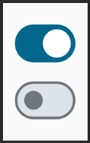
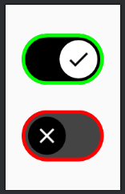

# Switch

Switch é um componente simples para uma função de ***checked*** e ***unchecked***. Não há muito segredo nele, então vamos à implementação básica:

```kotlin
@Composable
private fun Switch() {
    var checked by remember { mutableStateOf(true) }
    Switch(
        checked = checked,
        onCheckedChange = { isChecked ->
            checked = isChecked
        }
    )
}
```



Também é possível personalizar a **thumbContent**, que pode ser o ícone exibido durante o estado marcado ou desmarcado, além, é claro, de podermos modificar as cores facilmente:

```kotlin
@Composable
private fun Switch() {
    var checked by remember { mutableStateOf(true) }
    Switch(
        checked = checked,
        onCheckedChange = { isChecked ->
            checked = isChecked
        },
        thumbContent = {
            val icon = if (checked) Icons.Filled.Check else Icons.Filled.Close
            Icon(
                imageVector = icon,
                contentDescription = "Switch",
                modifier = Modifier.size(SwitchDefaults.IconSize),
            )
        },
        colors = SwitchDefaults.colors(
            checkedThumbColor = Color.White,
            uncheckedThumbColor = Color.Black,
            checkedTrackColor = Color.Black,
            uncheckedTrackColor = Color.DarkGray,
            checkedIconColor = Color.Black,
            uncheckedIconColor = Color.White,
            checkedBorderColor = Color.Green,
            uncheckedBorderColor = Color.Red
        )
    )
}
```



## :link: Conteúdos auxiliares:
- [Switch (documentação)](https://developer.android.com/jetpack/compose/components/switch)
- [Switch (Material Design 3)](https://m3.material.io/components/switch/overview)