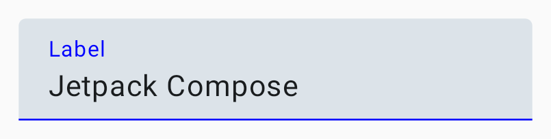
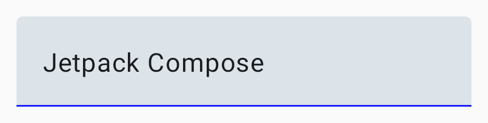
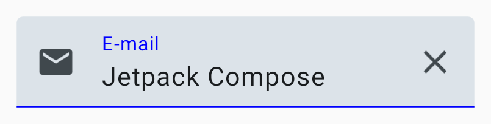
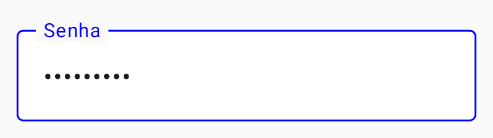
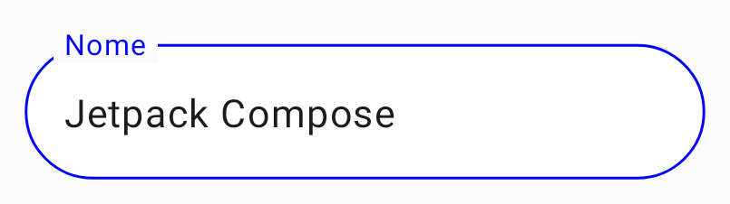

# TextField

No **TextField** você começará a ver conceitos interessantes que se repetirão bastante no Compose. Vamos falar sobre algumas delas antes de ver os exemplos de código.

- Como se trata de um campo de texto editável, o **TextField** usará o que já falamos no começo sobre **estados** (o texto) e **eventos** (quando o usuário digitar algo). No exemplo do código, temos uma linha importante: ```var text by remember { mutableStateOf("") }```. Basicamente essa variável será lida como um estado que, ao ser modificada, acionará a **recomposição**. Ou seja, o texto do **TextField** mudará. Veremos explicações melhores sobre isso na seção sobre [**estados**](../state.md).
- **TextField** tem diversos parâmetros que **recebem como argumentos funções Composable**. Por exemplo, **label**. Ao invés de passarmos apenas uma String ou algo do tipo, podemos colocar o componente **Text()** ou o que quisermos de Composable. Isso é muito útil no Compose e já vimos isso várias vezes na seção de layouts de forma implícita. Por exemplo, **Column** tem como último parâmetro uma Composable: ```content: @Composable() (ColumnScope.() -> Unit)```.
- Ele usa o padrão de **state hoisting (elevação de estado)**. Recebe o valor com **value** e, quando esse valor muda, aciona **onValueChange** com o novo valor. Esse mesmo comportamento se repetirá em vários outros componentes que você verá nessa seção. Também veremos mais disso na seção sobre [**estados**](../state.md).

Vamos ao exemplo de um **TextField**:

```kotlin
@Composable
private fun TextField() {
    var text by remember { mutableStateOf("") }
    TextField(
        value = text,
        onValueChange = { newText ->
            text = newText
        },
        label = {
            Text(text = "Label")
        },
        colors = TextFieldDefaults.colors(
            unfocusedIndicatorColor = Color.Blue,
            unfocusedLabelColor = Color.Blue
        )
    )
}
```



Se trocarmos o parâmetro **label** por **placeholder**, quando digitarmos algo, o **placeholder** não irá aparecer:



Também temos várias outras opções, como **leadingIcon**, **trailingIcon** e **keyboardOptions**:

```kotlin
@Composable
private fun TextField() {
    var text by remember { mutableStateOf("") }
    TextField(
        value = text,
        onValueChange = { newText ->
            text = newText
        },
        label = {
            Text(text = "E-mail")
        },
        leadingIcon = {
            Icon(
                imageVector = Icons.Default.Email,
                contentDescription = "Email icon"
            )
        },
        trailingIcon = {
            IconButton(onClick = { text = "" }) {
                Icon(
                    imageVector = Icons.Default.Close,
                    contentDescription = "Close icon"
                )
            }
        },
        keyboardOptions = KeyboardOptions(keyboardType = KeyboardType.Email),
        colors = TextFieldDefaults.colors(
            unfocusedIndicatorColor = Color.Blue,
            focusedLabelColor = Color.Blue
        )
    )
}
```



#### É bom lembrar...
Veja que usamos 2 ícones. Nós poderíamos definir as cores desses ícones com o parâmetro **tint**, mas não fizemos isso no exemplo acima. No TextField, evite modificar as cores de componentes como esse diretamente. Através da opção **colors** do TextField, você pode alterar as cores do **leadingIcon** e **trailingIcon**, tanto nos estados ***focused*** quanto ***unfocused***, assim como foi feito na **unfocusedIndicatorColor**. Se adicionarmos uma cor manualmente ao **Icon()**, perderemos essa função de cores dinâmicas nesses 2 estados do TextField.

## OutlinedTextField

Também temos a variação do TextField: **OutlinedTextField**. Basta mudar o nome **TextField** para **OutlinedTextField** que o estilo mudará. No exemplo abaixo, também usamos uma transformação de texto em formato de senha com **visualTransformation**.

```kotlin
@Composable
private fun OutlinedTextField() {
    var text by remember { mutableStateOf("") }
    OutlinedTextField(
        value = text,
        onValueChange = { newText ->
            text = newText
        },
        label = {
            Text(text = "Senha")
        },
        visualTransformation = PasswordVisualTransformation(),
        keyboardOptions = KeyboardOptions(keyboardType = KeyboardType.Password),
        colors = TextFieldDefaults.colors(
            unfocusedIndicatorColor = Color.Blue,
            unfocusedLabelColor = Color.Blue,
            unfocusedContainerColor = Color.White
        )
    )
}
```



Você também pode mudar o shape do TextField com o parâmetro **shape**, como por exemplo: ```shape = CircleShape```.



## BasicTextField e BasicTextField2

Compose também oferece a opção de **BasicTextField**, que é basicamente um **TextField** sem decorações que pode ser usado quando você quiser personalizar um TextField completamente. As opções que você viu acima são fornecidas através do pacote do ***Material Design 3***, que implementa nativamente diretrizes do Material Design 3, enquanto o **BasicTextField** é do ***androidx.compose.foundation.text***. As implementações do ***Material Design 3*** são mais recomendadas e serão suficientes na maioria das vezes. Consulte a [documentação](https://developer.android.com/jetpack/compose/text/user-input) caso queira saber mais sobre TextFields. Não colocarei imagens de exemplo porque visualmente ele é simplesmente um **Text()** editável, mas a implementação básica é semelhante ao que já vimos.

```kotlin
@Composable
private fun BasicTextField() {
    var text by remember { mutableStateOf("") }
    BasicTextField(
        value = text,
        onValueChange = { newText ->
            text = newText
        }
    )
}
```

A partir do **Jetpack Compose 1.6.0**, uma nova opção foi incluída: **BasicTextField2**. Ela tem como foco [corrigir alguns problemas atuais](https://medium.com/androiddevelopers/effective-state-management-for-textfield-in-compose-d6e5b070fbe5) do **BasicTextField**, bem como adicionar algumas novas funcionalidades. Atualmente **ainda está em fase experimental**. Além de suportar a mesma estrutura de código que vimos acima, ele também inclui uma nova estrutura onde o estado do **TextField** é gerenciado internamente pelo componente. Veja a implementação básica:

```kotlin
@OptIn(ExperimentalFoundationApi::class)
@Composable
private fun BasicTextField2() {
    val textFieldState = rememberTextFieldState()
    BasicTextField2(state = textFieldState)
}
```

Você pode ler mais sobre esse novo componente nessa sequência de artigos: **BasicTextField2: A TextField of Dreams**: [parte 1](https://proandroiddev.com/basictextfield2-a-textfield-of-dreams-1-2-0103fd7cc0ec) e [parte 2](https://medium.com/@astamato/basictextfield2-a-textfield-of-dreams-2-2-fdc7fbbf9ffb).

## :link: Conteúdos auxiliares:
- [Text fields (Material Design 3)](https://m3.material.io/components/text-fields/overview)