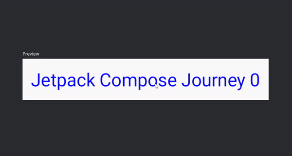

# Interoperabilidade: Usando Views no Compose

O Compose já possui suporte a muitos recursos e bibliotecas, no entanto, o ecossistema Android como um todo ainda tem dependências com o sistema de Views/XML e algumas bibliotecas ainda não oferecem suporte ao Jetpack Compose. Isso também é especialmente válido em um contexto de migração, onde um app com o sistema de Views está em processo de migração para o Compose. Como reescrever toda a base de código de uma vez muitas vezes é impensável, **Compose também oferece o recurso de interoperabilidade, onde podemos tanto usar Views no Compose, quanto usar Compose em Views**, o que facilita reescrever apenas as partes essenciais por etapas.

Nessa seção vamos ver uma breve introdução a esse recurso de interoperabilidade.

## AndroidView

Compose possui o componente **AndroidView()** para utilizar Views em Composables. Vamos usar o [**TextView**](https://developer.android.com/reference/android/widget/TextView) como um pequeno exemplo básico.

```kotlin
@Composable
private fun ComposeTextView() {
    var count by remember { mutableIntStateOf(0) }
    AndroidView(
        factory = { context ->
            // Cria e retorna a View (TextView)
            TextView(context).apply {
                // Aplica customizações iniciais
                textSize = 22f
                setTextColor(Color.Blue.toArgb())
                setOnClickListener {
                    count++
                }
            }
        },
        update = { textView ->
            // Atualiza a View de acordo com alguma mudança de estado
            textView.text = "Jetpack Compose Journey $count"
        },
        modifier = Modifier.fillMaxWidth()
    )
}
```



Temos duas propriedades importantes aqui:

- **factory** é onde inicializamos a View a ser utilizada. O trecho de código em **factory** será executado exatamente uma vez e é o lugar ideal para inicializar propriedades importantes iniciais. No código acima, definimos algumas pequenas propriedades do **TextView** e também adicionamos um **setOnClickListener()**, que será acionado sempre que o **TextView** for tocado.
- **update** será chamado múltiplas vezes e é o lugar certo para realizar atualizações de propriedades da View com base em alguma mudança de estado. Como ele é chamado múltiplas vezes nas recomposições, é importante estar atento para não realizar operações muito caras aqui.

Duas bibliotecas populares que ainda não oferecem suporte oficial ao Compose e podem ser utilizadas com **AndroidView()** são a [Media3/ExoPlayer](https://developer.android.com/media/media3) e [AdMob](https://developers.google.com/admob/android/quick-start).

## AndroidViewBinding e Fragments no Compose

Também é possível utilizar o componente **AndroidViewBinding** para carregar layouts gerados pelo **ViewBinding**. Porém, diferente do **AndroidView**, é preciso adicionar a dependência abaixo e ativar o [**ViewBinding**](https://developer.android.com/topic/libraries/view-binding) no **build.gradle (app)** (se você estiver usando XML, provavelmente já está fazendo esse último):

```gradle
android {
    ...
    buildFeatures {
        compose = true
        viewBinding = true
    }
    ...

dependencies {
    ...
    implementation("androidx.compose.ui:ui-viewbinding")
    ...
}
```

Dessa forma podemos utilizar o layout da seguinte forma abaixo, com o exemplo retirado da documentação:

```kotlin
@Composable
fun AndroidViewBindingExample() {
    AndroidViewBinding(ExampleLayoutBinding::inflate) {
        exampleView.setBackgroundColor(Color.GRAY)
    }
}
```

E para utilizar **Fragments**, também utilizamos **AndroidViewBinding**, que tem manipulação específica de **Fragment**, como a remoção do **Fragment** quando o Composable sai da composição. Faça isso inflando um XML contendo um **FragmentContainerView** como suporte para o **Fragment**.

Por exemplo, se você tiver **my_fragment_layout.xml**, poderá usar um código como o abaixo ao substituir o atributo XML **android:name** pelo nome da classe do **Fragment**:

```xml
<androidx.fragment.app.FragmentContainerView xmlns:android="http://schemas.android.com/apk/res/android"
    android:id="@+id/fragment_container_view"
    android:layout_width="match_parent"
    android:layout_height="match_parent"
    android:name="com.example.compose.snippets.interop.MyFragment" />
```

E no Compose, use da seguinte forma:

```kotlin
@Composable
fun FragmentInComposeExample() {
    AndroidViewBinding(MyFragmentLayoutBinding::inflate) {
        val myFragment = fragmentContainerView.getFragment<MyFragment>()
        // ...
    }
}
```

## Conclusão

Evitei exemplos mais elaborados nos tópicos de **AndroidViewBinding** e **Fragments** porque precisaria usar XML para ter algo mais prático. Como não é a intenção desse conteúdo abordar XML, achei melhor utilizar apenas os exemplos da própria documentação, pois caso você de fato precise disso, já deve estar familiarizado com XML para tal e essa pequena introdução pode ser o suficiente até ler a documentação.

Vimos apenas o uso de Views no Compose, mas como dito antes, também podemos utilizar Compose em Views. Pelos mesmos motivos citados acima, evitarei falar sobre esse tópico nessa seção e você pode ler mais sobre isso na documentação.

## :link: Conteúdos auxiliares:
- [Using Compose in Views (documentação)](https://developer.android.com/jetpack/compose/migrate/interoperability-apis/compose-in-views)
- [Using Views in Compose (documentação)](https://developer.android.com/jetpack/compose/migrate/interoperability-apis/views-in-compose)