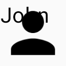
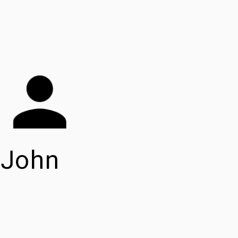

# Layouts

Construir seus layouts é obviamente uma parte fundamental em qualquer app. Essa seção descreve um pouco sobre o layout Column.

## Sem layout

Sem especificar um layout, os componentes Composable vão ser colocados uns sobre os outros, deixando completamente desorganizado. Veja um exemplo:

```kotlin
@Composable
fun Profile() {
    Image(
        painter = painterResource(id = R.drawable.baseline_person_24),
        contentDescription = "profile image",
        modifier = Modifier.size(50.dp)
    )
    Text(text = "John")
}
```



## Column

Como o nome sugere, uma **Column** é uma espécie de coluna onde cada elemento é colocado um abaixo do outro, verticalmente.
É o equivalente a um **LinearLayout** com a orientação vertical. Vamos usar o código anterior e envolvê-lo em uma Column para ver como fica:

```kotlin
@Composable
fun Profile() {
    Column {
        Image(
            painter = painterResource(id = R.drawable.baseline_person_24),
            contentDescription = "profile image",
            modifier = Modifier.size(50.dp)
        )
        Text(text = "John")
    }
}
```


### Alinhamento de uma Column

Uma Column possui mais 2 parâmetros que podem ser usados para alinhar o conteúdo horizontal e vertical.
Veja como ficaria o alinhamento horizontal ao modificar o **horizontalAlignment**:

=== "Alignment.Start" 

    

    ```kotlin
    @Composable
    fun Profile() {
        Column(
           horizontalAlignment = Alignment.Start,
           modifier = Modifier.width(250.dp)
        ) {
            ...
        }
    }
    ```

=== "Alignment.CenterHorizontally" 

    

    ```kotlin
    @Composable
    fun Profile() {
        Column(
           horizontalAlignment = Alignment.CenterHorizontally,
           modifier = Modifier.width(250.dp)
        ) {
            ...
        }
    }
    ```

=== "Alignment.End" 

    

    ```kotlin
    @Composable
    fun Profile() {
        Column(
           horizontalAlignment = Alignment.End,
           modifier = Modifier.width(250.dp)
        ) {
            ...
        }
    }
    ```

E, claro, também podemos modificar o **verticalArrangement**.

=== "Arrangement.Top" 

    

    ```kotlin
    @Composable
    fun Profile() {
        Column(
           verticalArrangement = Arrangement.Top,
           modifier = Modifier.size(150.dp)
        ) {
            ...
        }
    }
    ```

=== "Arrangement.Center" 

    

    ```kotlin
    @Composable
    fun Profile() {
        Column(
           verticalArrangement = Arrangement.Center,
           modifier = Modifier.size(150.dp)
        ) {
            ...
        }
    }
    ```

=== "Arrangement.Bottom" 

    

    ```kotlin
    @Composable
    fun Profile() {
        Column(
           verticalArrangement = Arrangement.Bottom,
           modifier = Modifier.size(150.dp)
        ) {
            ...
        }
    }
    ```

=== "Arrangement.SpaceBetween" 

    

    ```kotlin
    @Composable
    fun Profile() {
        Column(
           verticalArrangement = Arrangement.SpaceBetween,
           modifier = Modifier.size(150.dp)
        ) {
            ...
        }
    }
    ```

Também podemos fazer uma combinações de **verticalArrangement** e **horizontalAlignment** para deixar todo o conteúdo centralizado verticalmente e horizontalmente, por exemplo.

```kotlin
@Composable
fun Profile() {
    Column(
        verticalArrangement = Arrangement.Center,
        horizontalAlignment = Alignment.CenterHorizontally,
        modifier = Modifier.size(150.dp)
    ) {
        ...
    }
}
```


#### Modificando o alinhamento manualmente em cada componente

Também é possível modificar o alinhamento dos componentes diretamente através do ```Modifier.align()```. Por exemplo, ao invés de usarmos ```horizontalAlignment = Alignment.CenterHorizontally``` na Column em si, podemos obter o mesmo resultado aplicando ```Modifier.align()``` em cada componente:

```kotlin
@Composable
fun Profile() {
    Column(
        modifier = Modifier.width(250.dp)
    ) {
        Image(
            painter = painterResource(id = R.drawable.baseline_person_24),
            contentDescription = "profile image",
            modifier = Modifier
                .size(50.dp)
                .align(Alignment.CenterHorizontally)
        )
        Text(
            text = "John",
            modifier = Modifier.align(Alignment.CenterHorizontally)
        )
    }
}
```


- É importante notar que dentro da Column só podemos modificar o alinhamento horizontal dessa forma. Se tentarmos aplicar ```Alignment.Bottom```, por exemplo, você verá um erro, pois ```Modifier.align()``` espera um ```Alignment.Horizontal``` e não um ```Alignment.Vertical```, como é o caso de ```Alignment.Bottom```.
Também vale ressaltar que ```Modifier.align()``` tem prioridade sobre o **horizontalAlignment** da Column. Portanto, se você usar ```horizontalAlignment = Alignment.End``` na Column, mas ```Modifier.align(Alignment.Start)``` no componente, ele será alinhado com **Alignment.Start**.

## :link: Conteúdos auxiliares:
- [Compose layout basics (documentação)](https://developer.android.com/jetpack/compose/layouts/basics)