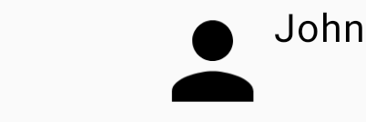

# Row

Enquanto uma **Column** alinha os elementos um abaixo do outro de forma vertical, uma **Row** alinha um ao lado do outro, de forma horizontal. É o equivalente a um **LinearLayout** com a orientação horizontal.

```kotlin
@Composable
fun Profile() {
    Row {
        Image(
            painter = painterResource(id = R.drawable.baseline_person_24),
            contentDescription = "Profile image",
            modifier = Modifier.size(50.dp)
        )
        Text(text = "John")
    }
}
```


## Alinhamento de uma Row

Assim como a **Column**, **Row** possui mais 2 parâmetros que podem ser usados para alinhar o conteúdo. Vamos modificar o **horizontalArrangement** e ver como fica:

=== "Arrangement.Start" 

    

    ```kotlin
    @Composable
    fun Profile() {
        Row(
           horizontalArrangement = Arrangement.Start,
           modifier = Modifier.width(150.dp)
        ) {
            ...
        }
    }
    ```

=== "Arrangement.Center" 

    

    ```kotlin
    @Composable
    fun Profile() {
        Row(
           horizontalArrangement = Arrangement.Center,
           modifier = Modifier.width(150.dp)
        ) {
            ...
        }
    }
    ```

=== "Arrangement.End" 

    

    ```kotlin
    @Composable
    fun Profile() {
        Row(
           horizontalArrangement = Arrangement.End,
           modifier = Modifier.width(150.dp)
        ) {
            ...
        }
    }
    ```

=== "Arrangement.SpaceBetween" 

    

    ```kotlin
    @Composable
    fun Profile() {
        Row(
           horizontalArrangement = Arrangement.SpaceBetween,
           modifier = Modifier.width(150.dp)
        ) {
            ...
        }
    }
    ```

=== "Arrangement.SpaceEvenly" 

    

    ```kotlin
    @Composable
    fun Profile() {
        Row(
           horizontalArrangement = Arrangement.SpaceEvenly,
           modifier = Modifier.width(150.dp)
        ) {
            ...
        }
    }
    ```

Também podemos fazer uma combinação de **horizontalArrangement** e **verticalAlignment** para deixar todo o conteúdo centralizado, por exemplo.

```kotlin
@Composable
fun Profile() {
    Row(
        horizontalArrangement = Arrangement.Center,
        verticalAlignment = Alignment.CenterVertically,
        modifier = Modifier.size(150.dp)
    ) {
        ...
    }
}
```


## :link: Conteúdos auxiliares:
- [Compose layout basics (documentação)](https://developer.android.com/jetpack/compose/layouts/basics)