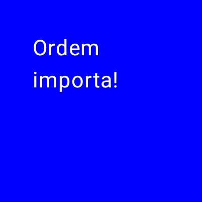
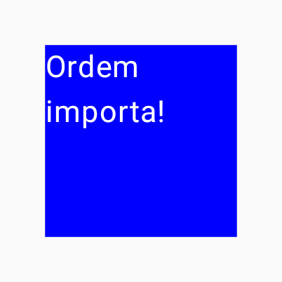
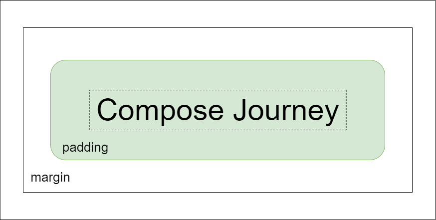
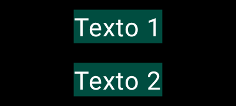
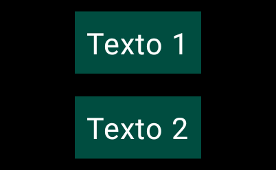
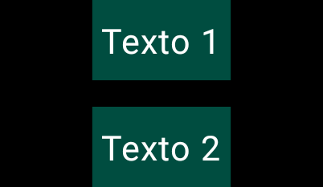
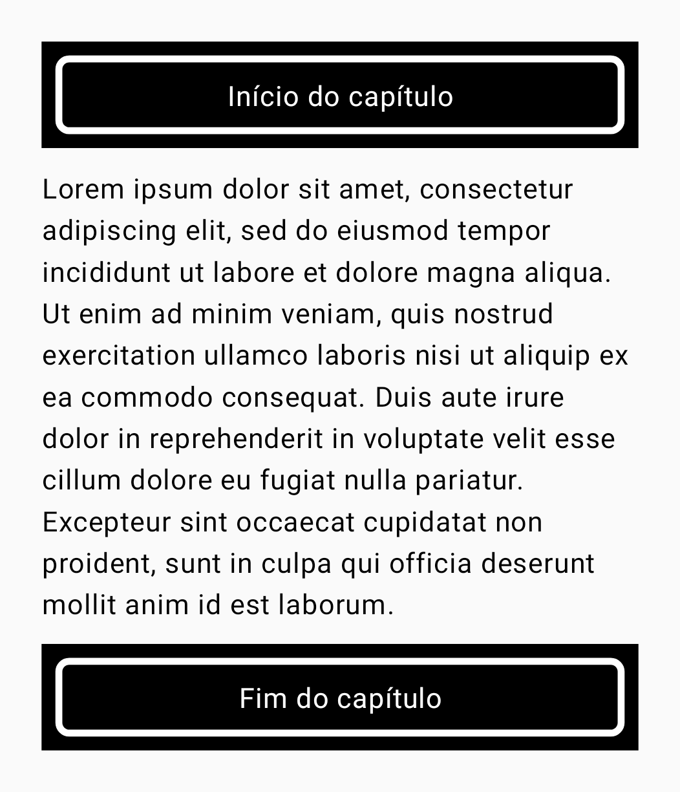
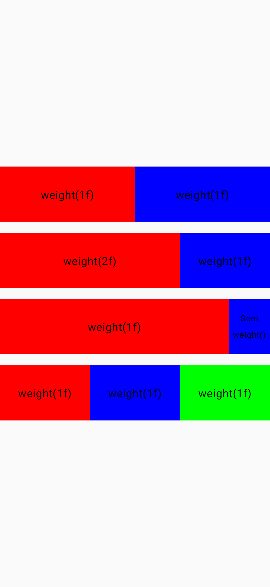

# Modifiers

Já vimos em seções anteriores vários usos do Modifier. Essa seção é dedicada em falar um pouco sobre ele e algumas outras funções que ele fornece.

Os modificadores são praticamente onipresentes e permitem decorar as funções Composables de várias formas. Como já vimos antes, além de várias outras opções, com ele é possível fazer coisas como:

- Adicionar uma cor de fundo com ```Modifier.background()```;
- Alterar o tamanho com ```Modifier.size()```;
- Adicionar um padding com ```Modifier.padding()```.

## A ordem dos modificadores importa

A ordem dos Modifiers é **significativa**. Como cada função faz alterações no Modifier anterior, a sequência afeta o resultado final. Vejamos um exemplo disso:

```kotlin
@Composable
private fun Item() {
    Box(
        modifier = Modifier
            .size(150.dp)
            .background(Color.Blue)
            .padding(24.dp)
    ) {
        Text(
            text = "Ordem importa!",
            color = Color.White
        )
    }
}
```



Agora vamos mudar a ordem do ```background()``` e do ```padding()```:

```kotlin
@Composable
private fun Item() {
    Box(
        modifier = Modifier
            .size(150.dp)
            .padding(24.dp)
            .background(Color.Blue)
    ) {
        Text(
            text = "Ordem importa!",
            color = Color.White
        )
    }
}
```



Isso aconteceu porque no primeiro exemplo definimos a cor de fundo antes de definirmos um espaçamento, o que fez com que a cor preenchesse todo o Box. Já no segundo exemplo, definimos um espaçamento antes e, por consequência, a cor de fundo só preencheu o espaço já modificado pelo ```padding()```.

Vamos ver mais um exemplo, agora de como o ```Modifier.clickable()``` pode ser afetado com outros modificadores. Veja o código abaixo:

```kotlin
@Composable
private fun CarItem() {
    Column(
        horizontalAlignment = Alignment.CenterHorizontally,
        modifier = Modifier
            .clickable {}
            .padding(26.dp)
            .fillMaxWidth()
    ) {
        Image(
            painter = painterResource(id = R.drawable.img_car),
            contentDescription = null,
            contentScale = ContentScale.Crop,
            modifier = Modifier
                .size(width = 300.dp, height = 250.dp)
                .clip(RoundedCornerShape(16.dp))
        )
    }
}
```


É possível clicar e o efeito de clique é aplicado em toda a área da **Column**. Porém, mudando a ordem dos modificadores, colocando o ```padding()``` primeiro e o ```clickable()``` após ele, nós temos o seguinte resultado:


Agora veja que a **Column** não é mais completamente clicável, pois o ```Modifier.clickable()``` foi afetado pelo ```Modifier.padding()```.

## Margin no Compose



Diferente do sistema de Views, o Compose não possui uma opção para **margin** como no XML. Como basicamente **margin** é o espaçamento entre o componente e outros componentes, e **padding** é o espaçamento interno do conteúdo do componente, ambas funcionalidades podem ser obtidas com ```Modifier.padding()``` utilizando o mesmo princípio da ordem de modificadores que vimos anteriormente.  

Vamos ver um pequeno exemplo. Veja o código abaixo:

```kotlin
@Composable
private fun MarginAndPadding() {
    Column(
        horizontalAlignment = Alignment.CenterHorizontally,
        modifier = Modifier
            .background(Color.Black)
            .width(150.dp)
    ) {
        Text(
            text = "Texto 1",
            color = Color.White,
            modifier = Modifier
                .background(Color(0xFF004D40))
        )
        Text(
            text = "Texto 2",
            color = Color.White,
            modifier = Modifier
                .background(Color(0xFF004D40))
        )
    }
}
```


Agora vamos aplicar uma **margin** em ambos os textos utilizando ```Modifier.padding()```:

```kotlin
@Composable
private fun MarginAndPadding() {
    Column(
       ...
    ) {
        Text(
            ...
            modifier = Modifier
                .padding(6.dp) // Margin
                .background(Color(0xFF004D40))
        )
        Text(
            ...
            modifier = Modifier
                .padding(6.dp) // Margin
                .background(Color(0xFF004D40))
        )
    }
}
```



Agora vamos adicionar um **padding**:

```kotlin
@Composable
private fun MarginAndPadding() {
    Column(
       ...
    ) {
        Text(
            ...
            modifier = Modifier
                .padding(6.dp) // Margin
                .background(Color(0xFF004D40))
                .padding(6.dp) // Padding
        )
        Text(
            ...
            modifier = Modifier
                .padding(6.dp) // Margin
                .background(Color(0xFF004D40))
                .padding(6.dp) // Padding
        )
    }
}
```



Como você pode ver, ambas as funcionalidades de **margin** e **padding** podem ser atingidas com ```Modifier.padding()```, apenas tendo em mente a ordem dos modificadores. Note que da forma que estamos usando, o espaçamento será aplicado em todas as direções, pois o parâmetro padrão é **all**. Existem outras funções ```Modifier.padding()``` que aceitam argumentos diferentes, como direções (start, end, top e bottom) ou orientações (vertical e horizontal). Por exemplo:

```kotlin
@Composable
private fun MarginAndPadding() {
    Column(
       ...
    ) {
        Text(
            ...
             modifier = Modifier
                .padding(bottom = 6.dp) // Margin
                .background(Color(0xFF004D40))
                .padding(
                    start = 4.dp,
                    end = 4.dp,
                    top = 8.dp,
                    bottom = 8.dp
                ) // Padding
        )
        Text(
            ...
             modifier = Modifier
                .padding(top = 6.dp) // Margin
                .background(Color(0xFF004D40))
                .padding(
                    start = 4.dp,
                    end = 4.dp,
                    top = 8.dp,
                    bottom = 8.dp
                ) // Padding
        )
    }
}
```



Como usamos os mesmos valores para as direções com a mesma orientação, podemos apenas utilizar **horizontal** e **vertical** para atingir o mesmo resultado:

```kotlin
@Composable
private fun MarginAndPadding() {
    Column(
       ...
    ) {
        Text(
            ...
            modifier = Modifier
                .padding(bottom = 6.dp) // Margin
                .background(Color(0xFF004D40))
                .padding(horizontal = 4.dp, vertical = 8.dp) // Padding
        )
        Text(
            ...
            modifier = Modifier
                .padding(top = 6.dp) // Margin
                .background(Color(0xFF004D40))
                .padding(horizontal = 4.dp, vertical = 8.dp) // Padding
        )
    }
}
```


Se tudo que você precisa é de uma **margin** em um componente para criar um espaço em relação ao outro, como um **marginTop** do XML, você pode utilizar o componente **Spacer()** com ```Modifier.height()``` ou ```Modifier.width()```, que pode ser um pouco mais intuitivo. Por exemplo, ao invés disso:

```kotlin
@Composable
private fun MarginAndPadding() {
    Column(
       ...
    ) {
        Text(
            ...
            modifier = Modifier
                .background(Color(0xFF004D40))
                .padding(horizontal = 4.dp, vertical = 8.dp) // Padding
        )
        Text(
            ...
            modifier = Modifier
                .padding(top = 8.dp) // Equivalente ao marginTop do XML
                .background(Color(0xFF004D40))
                .padding(horizontal = 4.dp, vertical = 8.dp) // Padding
        )
    }
}
```

Você pode fazer isso:

```kotlin
@Composable
private fun MarginAndPadding() {
    Column(
       ...
    ) {
        Text(
            ...
            modifier = Modifier
                .background(Color(0xFF004D40))
                .padding(horizontal = 4.dp, vertical = 8.dp) // Padding
        )
        Spacer(Modifier.height(8.dp))
        Text(
            ...
            modifier = Modifier
                .background(Color(0xFF004D40))
                .padding(horizontal = 4.dp, vertical = 8.dp) // Padding
        )
    }
}
```

## Modificadores condicionais

Às vezes queremos utilizar modificadores de acordo com uma condição. Existe uma função ```Modifier.then()``` que concatena um Modifier com outro, permitindo criar modificadores condicionais com facilidade. Veja um exemplo disso:

```kotlin
@Composable
private fun ConditionalModifier(showBackgroundAndBorderColor: Boolean) {
    Text(
        text = "Compose Journey",
        modifier = Modifier
            .padding(12.dp)
            .then(
                if (showBackgroundAndBorderColor) {
                    Modifier
                        .background(MaterialTheme.colorScheme.primaryContainer)
                        .border(BorderStroke(2.dp, MaterialTheme.colorScheme.primary))
                        .padding(6.dp)
                } else {
                    Modifier
                }
            )
    )
}
```

No código acima, se **showBackgroundAndBorderColor** for verdadeiro, concatenamos o Modifier atual do **Text()** com o Modifier que criamos na condição. Se não, apenas criamos um Modifier vazio que não fará nada. Não estamos adicionando mais nenhum Modifier no **Text()** após o ```then()```, mas você também pode fazer isso, se necessário. Lembre-se que o Modifier criado no ```Modifier.then()``` também segue a regra de ordem de modificadores que foi discutida antes.

## Extraindo e reutilizando modificadores

Às vezes, pode ser benéfico reutilizar as mesmas instâncias de cadeia de modificadores em vários Composables, extraindo-os em variáveis ​​e elevando-os para escopos superiores. Ele pode melhorar a legibilidade do código ou ajudar a melhorar o desempenho do aplicativo por alguns motivos:

- A realocação dos modificadores não será repetida quando ocorrer a recomposição de elementos que podem ser compostos que os utilizam.
- As cadeias de modificadores podem ser potencialmente muito longas e complexas, portanto, reutilizar a mesma instância de uma cadeia pode aliviar a carga de trabalho que o Compose runtime precisa realizar ao compará-las.
- Esta extração promove uma limpeza de código, consistência e capacidade de manutenção em toda a base de código.

Por exemplo, no código abaixo usamos o mesmo Modifier para 2 textos:

```kotlin
private const val loremIpsumText = "..."

@Composable
private fun ReaderScreen() {
    Column(
        modifier = Modifier
            .padding(24.dp)
            .verticalScroll(rememberScrollState())
    ) {
        Text(
            text = "Início do capítulo",
            color = Color.White,
            textAlign = TextAlign.Center,
            modifier = Modifier
                .fillMaxWidth()
                .background(Color.Black)
                .padding(8.dp)
                .border(
                    width = 4.dp,
                    color = Color.White,
                    shape = RoundedCornerShape(8.dp)
                )
                .padding(12.dp)
        )
        Text(
            text = loremIpsumText,
            modifier = Modifier.padding(vertical = 12.dp)
        )
        Text(
            text = "Fim do capítulo",
            color = Color.White,
            textAlign = TextAlign.Center,
            modifier = Modifier
                .fillMaxWidth()
                .background(Color.Black)
                .padding(8.dp)
                .border(
                    width = 4.dp,
                    color = Color.White,
                    shape = RoundedCornerShape(8.dp)
                )
                .padding(12.dp)
        )
    }
}
```

Então podemos extrair e reutilizar:

```kotlin
private const val loremIpsumText = "..."

val reusableModifier = Modifier
    .fillMaxWidth()
    .background(Color.Black)
    .padding(8.dp)
    .border(
        width = 4.dp,
        color = Color.White,
        shape = RoundedCornerShape(8.dp)
    )
    .padding(12.dp)

@Composable
private fun ReaderScreen() {
    Column(
        modifier = Modifier
            .padding(24.dp)
            .verticalScroll(rememberScrollState())
    ) {
        Text(
            text = "Início do capítulo",
            color = Color.White,
            textAlign = TextAlign.Center,
            modifier = reusableModifier
        )
        Text(
            text = loremIpsumText,
            modifier = Modifier.padding(vertical = 12.dp)
        )
        Text(
            text = "Fim do capítulo",
            color = Color.White,
            textAlign = TextAlign.Center,
            modifier = reusableModifier
        )
    }
}
```



No exemplo de código acima, o Modifier é extraído da função Composable. Os modificadores podem estar com ou sem escopo para um Composable. Nesse caso, estamos usando um Modifier sem escopo. Mas é importante notar que alguns modificadores só podem ser usados dentro de escopos específicos, como você verá em seguida sobre segurança de escopo, o que pode exigir que o modificador seja criado dentro do Composable.

Esse tipo de prática pode ser especialmente benéfica quando combinado com lazy layouts, como [**LazyColumn**](../lists). Na maioria dos casos, você deseja que toda a quantidade potencialmente significativa de itens tenha exatamente os mesmos modificadores. Veja o exemplo abaixo retirado da documentação:

```kotlin
val reusableItemModifier = Modifier
    .padding(bottom = 12.dp)
    .size(216.dp)
    .clip(CircleShape)

@Composable
private fun AuthorList(authors: List<Author>) {
    LazyColumn {
        items(authors) {
            AsyncImage(
                // ...
                modifier = reusableItemModifier,
            )
        }
    }
}
```

## Segurança de escopo no Compose

No Compose, há modificadores que só podem ser usados ​​quando aplicados a filhos de determinados Composables. O Compose impõe isso por meio de escopos personalizados.

Por exemplo, se você quiser deixar um filho tão grande quanto o Box pai sem afetar o tamanho do Box, use o ```Modificador.matchParentSize()```. Ele só está disponível em um ```BoxScope```. Portanto, ele só pode ser usado em um filho dentro de um dos Box pais.

A segurança do escopo evita que você adicione modificadores que não funcionariam em outros Composables e escopos, além de economizar tempo de tentativa e erro. Por exemplo:

```kotlin
@Composable
private fun Item() {
    Box(
        modifier = Modifier
            .size(100.dp)
            .background(Color.Blue)
    ) {
        Box(
            modifier = Modifier
                .background(Color.Red)
                // Funciona, pois está em um BoxScope
                .matchParentSize()
        )
    }
}
```

```kotlin
@Composable
private fun Item() {
    Column(
        modifier = Modifier
            .size(100.dp)
            .background(Color.Blue)
    ) {
        Box(
            modifier = Modifier
                .background(Color.Red)
                // Não funciona, pois está em um ColumnScope
                .matchParentSize()
        )
    }
}
```

#### Modifier.weight()

Você pode definir o tamanho do Composable para ser flexível dentro de seu pai usando o ```Modifier.weight()```. Ele está disponível apenas em **RowScope** e **ColumnScope**. Veja alguns exemplos de seu uso com diferentes pesos:

```kotlin
@Composable
private fun ModifierWeight() {
    Column(
        verticalArrangement = Arrangement.Center,
        modifier = Modifier.fillMaxSize()
    ) {
        Row(modifier = Modifier.fillMaxWidth()) {
            Box(
                contentAlignment = Alignment.Center,
                modifier = Modifier
                    .background(Color.Red)
                    .height(80.dp)
                    .weight(1f)
            ) { Text(text = "weight(1f)") }

            Box(
                contentAlignment = Alignment.Center,
                modifier = Modifier
                    .background(Color.Blue)
                    .height(80.dp)
                    .weight(1f)
            ) { Text(text = "weight(1f)") }
        }

        Spacer(Modifier.height(16.dp))

        Row(modifier = Modifier.fillMaxWidth()) {
            Box(
                contentAlignment = Alignment.Center,
                modifier = Modifier
                    .background(Color.Red)
                    .height(80.dp)
                    .weight(2f)
            ) { Text(text = "weight(2f)") }

            Box(
                contentAlignment = Alignment.Center,
                modifier = Modifier
                    .background(Color.Blue)
                    .height(80.dp)
                    .weight(1f)
            ) { Text(text = "weight(1f)") }
        }

        Spacer(Modifier.height(16.dp))

        Row(modifier = Modifier.fillMaxWidth()) {
            Box(
                contentAlignment = Alignment.Center,
                modifier = Modifier
                    .background(Color.Red)
                    .height(80.dp)
                    .weight(1f)
            ) { Text(text = "weight(1f)") }

            Box(
                contentAlignment = Alignment.Center,
                modifier = Modifier
                    .background(Color.Blue)
                    .size(height = 80.dp, width = 60.dp)
            ) {
                Text(
                    text = "Sem weight()",
                    fontSize = 12.sp,
                    textAlign = TextAlign.Center
                )
            }
        }

        Spacer(Modifier.height(16.dp))

        Row(modifier = Modifier.fillMaxWidth()) {
            Box(
                contentAlignment = Alignment.Center,
                modifier = Modifier
                    .background(Color.Red)
                    .height(80.dp)
                    .weight(1f)
            ) { Text(text = "weight(1f)") }

            Box(
                contentAlignment = Alignment.Center,
                modifier = Modifier
                    .background(Color.Blue)
                    .height(80.dp)
                    .weight(1f)
            ) { Text(text = "weight(1f)") }

            Box(
                contentAlignment = Alignment.Center,
                modifier = Modifier
                    .background(Color.Green)
                    .height(80.dp)
                    .weight(1f)
            ) { Text(text = "weight(1f)") }
        }
    }
}
```



## Um parâmetro Modifier opcional

Você já deve ter notado que praticamente todo componente no Compose possui um parâmetro **Modifier** opcional, certo? Isso acontece porque **é uma boa prática sempre adicionar um parâmetro Modifier opcional aos Composables**, pois como já foi discutido antes, com ele você pode alterar alguns comportamentos do Composable sem muito esforço. Por exemplo, com o Modifier como opção, o chamador pode usar ```Modifier.align()``` para alinhar o componente como desejar, dependendo do layout que está criando.

Portanto, quando estiver criando seu componente, é recomendável sempre colocar um parâmetro Modifier opcional. É importante ser opcional porque o chamador nem sempre irá usar o Modifier. **Ele deve ser o primeiro parâmetro opcional**. Veja o exemplo abaixo, os parâmetros **text** e **onClick** não são opcionais, portanto, ele fica logo abaixo deles:

```kotlin
@Composable
fun MyCustomButton(
    text: String,
    onClick: () -> Unit,
    modifier: Modifier = Modifier,
    colors: MyButtonColors = MyButtonColors.colors()
)
```

**EVITE**:

```kotlin
@Composable
fun MyCustomButton(
    text: String,
    onClick: () -> Unit
)
```

**EVITE**:

```kotlin
@Composable
fun IconButton(
    buttonBitmap: ImageBitmap,
    modifier: Modifier = Modifier,
    tint: Color = Color.Black
) {
    Box(Modifier.padding(16.dp)) {
        Icon(
            buttonBitmap,
            tint = tint,
            // Modifier deve ser colocado no layout mais externo
            // e deve ser o primeiro na cadeia. Aqui ele deveria 
            // estar no Box
            modifier = Modifier.aspectRatio(1f).then(modifier),
        )
    }
}
```

**EVITE**:

```kotlin
@Composable
fun Icon(
    bitmap: ImageBitmap,
    // padding(8.dp) será perdido assim que o chamador definir seu próprio Modifier
    modifier: Modifier = Modifier.padding(8.dp)
    tint: Color = Color.Black
) {
    Box(modifier) {
        ...
    }
}
```

**FAÇA**:

```kotlin
@Composable
fun IconButton(
    buttonBitmap: ImageBitmap,
    modifier: Modifier = Modifier,
    tint: Color = Color.Black
) {
    Box(modifier.padding(16.dp)) {
        ...
    }
}
```

**EVITE**:

```kotlin
@Composable
fun CheckboxRow(
    checked: Boolean,
    onCheckedChange: (Boolean) -> Unit,
    // Modifier destina-se a especificar o comportamento
    // externo do CheckboxRow nesse caso, não suas subpartes
    rowModifier: Modifier = Modifier,
    checkboxModifier: Modifier = Modifier
)
```

#### Modifier como último argumento

Não é nenhuma regra específica, mas como o Modifier costuma ter vários modificadores, às vezes é interessante colocá-lo como último argumento para uma melhor legibilidade. Por exemplo, ao invés disso:

```kotlin
@Composable
private fun Item() {
    Text(
        text = "Jetpack Compose",
        color = Color.White,
        modifier = Modifier
            .background(Color.Black)
            .padding(4.dp)
            .clickable {},
        fontSize = 18.sp,
        fontFamily = FontFamily.Cursive
    )
}
```

Você pode fazer isso:

```kotlin
@Composable
private fun Item() {
    Text(
        text = "Jetpack Compose",
        color = Color.White,
        fontSize = 18.sp,
        fontFamily = FontFamily.Cursive,
        modifier = Modifier
            .background(Color.Black)
            .padding(4.dp)
            .clickable {}
    )
}
```

## Conclusão

Você pode ler mais sobre **Modifiers** na documentação e nos artigos auxiliares. Como pôde ver, eles são bem importantes e sempre utilizados no Compose. Há uma vasta lista de Modifiers, essa seção focou mais na teoria do que prática sobre Modifiers específicos. Ao longo do tempo, você aprenderá e usará vários deles.

## :link: Conteúdos auxiliares:
- [Modifiers (documentação)](https://developer.android.com/jetpack/compose/modifiers)
- [Modifier parameter (guidelines)](https://github.com/androidx/androidx/blob/androidx-main/compose/docs/compose-component-api-guidelines.md#modifier-parameter)
- [What can Advanced / Lesser Known Modifiers do for your UI? — A Comprehensive Exploration in Jetpack Compose (artigo)](https://proandroiddev.com/what-can-advanced-lesser-known-modifiers-do-for-your-ui-9c76855bced6)