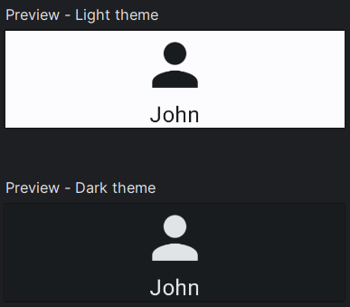

# Previews: Visualize seus layouts

Jetpack Compose fornece um meio de visualizar seus layouts e componentes através de **Previews**. Previews nada mais são do que funções Composable com mais uma anotação: ```@Preview```. Ao anotar a função com ```@Preview```, o Android Studio carregará uma visualização desse Composable. Veja o exemplo:


Normalmente, você adiciona o conteúdo da Preview com o tema do seu app, que é uma função Composable (normalmente) localizada no arquivo **Theme.kt**, onde são definidas as configurações do tema, como cores, shapes, typography etc. Como geralmente você define as cores e outros atributos dos componentes usando o tema do app, como um **Text()** com ```color = MaterialTheme.colorScheme.onPrimary``` (pode mudar dependendo do light e dark mode) ao invés de ```Color.White``` (valor literal), por exemplo, você se beneficia de algumas propriedades da Preview que vão ser abordadas em seguida.

Nesse caso, no exemplo da imagem acima, ao invés disso:

```kotlin
@Preview
@Composable
private fun Preview() { 
    Item()
}
```

Teremos isso:

```kotlin
@Preview
@Composable
private fun Preview() {
    MyAppTheme {
        Item()
    }
}
```

## Propriedades

Preview possui várias propriedades que você pode definir para alterar o comportamento da visualização. Veja alguns exemplos a seguir.

#### Mostrando UI do sistema

```@Preview(showSystemUi = true)```


#### Tema light e dark

Para ver uma real diferença, teremos um exemplo usando cores do tema, como ```MaterialTheme.colorScheme.surface``` e ```MaterialTheme.colorScheme.onSurface```.

```kotlin
@Composable
private fun Profile() {
    Column(
        horizontalAlignment = Alignment.CenterHorizontally,
        modifier = Modifier
            .width(250.dp)
            .background(MaterialTheme.colorScheme.surface)
    ) {
        Icon(
            painter = painterResource(id = R.drawable.baseline_person_24),
            contentDescription = "Profile image",
            tint = MaterialTheme.colorScheme.onSurface,
            modifier = Modifier
                .size(50.dp)
        )
        Text(
            text = "John",
            color = MaterialTheme.colorScheme.onSurface
        )
    }
}
```
Podemos usar várias **@Preview** numa mesma função, dessa forma carregará múltiplas previews do nosso conteúdo com as modificações que adicionarmos. Estamos modificando a propriedade **name** para a legibilidade no Android Studio e a **uiMode** de uma das Previews para usar o dark mode do tema.

```kotlin
@Preview(name = "Light theme")
@Preview(name = "Dark theme", uiMode = Configuration.UI_MODE_NIGHT_YES)
@Composable
private fun Preview() {
    MyAppTheme {
        Profile()
    }
}
```



#### Aparência e resolução da Preview com System UI

Podemos mudar a aparência da Preview para um dos dispositivos incluídos em **Devices**, dessa forma, mudamos também a resolução da mesma ao usarmos junto de **showSystemUi = true**. Isso é bastante útil para ver como seu layout se comporta em diferentes tamanhos de tela.

```kotlin
@Preview(
    name = "Devices.PIXEL_3A_XL",
    uiMode = Configuration.UI_MODE_NIGHT_YES,
    showSystemUi = true,
    device = Devices.PIXEL_3A_XL
)
@Preview(
    name = "Devices.NEXUS_7",
    uiMode = Configuration.UI_MODE_NIGHT_YES,
    showSystemUi = true,
    device = Devices.NEXUS_7
)
@Composable
private fun Preview() {
    MyAppTheme {
        Profile()
    }
}
```


#### Outras propriedades

Há algumas outras propriedades que você pode utilizar para alterar sua Preview, sendo algumas delas:

- **showBackground** e **backgroundColor**.
- **locale**, que você pode utilizar para carregar recursos alternativos com base no locale passado, como valores de **strings.xml**.

## Anotações Preview personalizadas

Você pode criar anotações personalizadas para fornecer multipreviews de uma forma mais facilitada. Por exemplo, ao invés de definirmos manualmente em cada preview do nosso projeto algo assim:

```kotlin
@Preview(name = "Light theme")
@Preview(name = "Dark theme", uiMode = Configuration.UI_MODE_NIGHT_YES)
@Composable
private fun Preview() { ... }
```

Podemos criar uma anotação personalizada:

```kotlin
@Preview(name = "Light theme")
@Preview(name = "Dark theme", uiMode = Configuration.UI_MODE_NIGHT_YES)
annotation class PreviewLightDark
```

Dessa forma podemos utilizar **PreviewLightDark** em nossas Previews facilmente:

```kotlin
@PreviewLightDark
@Composable
private fun Preview() { ... }
```

- A partir da versão **1.6.0** do **Jetpack Compose** ([Compose BOM 2024.01.00](https://developer.android.com/jetpack/compose/bom/bom-mapping), mais especificamente o **androidx.compose.ui:ui-tooling-preview:1.6.0**), foram introduzidas diversas novas anotações focadas em MultiPreview, como **@PreviewScreenSizes, @PreviewFontScales, @PreviewLightDark e @PreviewDynamicColors**. Você pode utilizá-las para evitar criar anotações manualmente para esses casos mais comuns.

## Outros pontos importantes

Você também pode executar sua Preview como se fosse uma tela normal do seu app, num dispositivo físico ou emulador. Basta tocar em **Run Preview**. É bastante útil se quiser ver uma tela inteira sem a necessidade de executar todo o app. A opção aparece tanto ao lado do nome da função Preview no código quanto no design. Também há uma opção para configurar rapidamente sua Preview com as propriedades que foram abordadas nessa seção, como pode ver no ícone de configuração na imagem abaixo.


Também é possível interagir com as Previews no **modo interativo** do Android Studio. Esse recurso é muito útil para visualizar alguns comportamentos simples, como mudanças de estados após um clique, animações etc. Veja o exemplo abaixo na imagem retirada da documentação.


## :link: Conteúdos auxiliares:
- [Previews (documentação)](https://developer.android.com/jetpack/compose/tooling/previews)
- [Animation Preview (documentação)](https://developer.android.com/jetpack/compose/tooling/animation-preview)