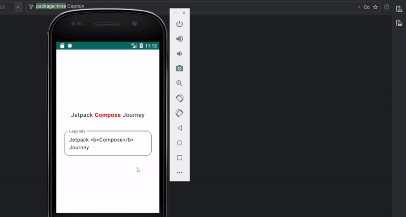

# Estado no Compose

Já falamos um pouco sobre estados em seções anteriores, mas nessa vamos ver de uma forma mais detalhada como isso funciona no Jetpack Compose. **Um estado é qualquer valor que pode mudar com o tempo**. Esta é uma definição muito ampla e abrange tudo, desde um banco de dados Room até uma variável em uma classe.

## Estado, composição e recomposição

Compose é declarativo e, como tal, a única maneira de atualizar nossa interface é chamando a mesma função Composable com novos argumentos. Mas nós não chamamos a função Composable manualmente, é claro, é o Compose que gerencia isso. Toda vez que um estado é alterado, o Compose aciona a **recomposição**, atualizando então a interface.

Ao ler o texto acima, pode-se pensar que podemos usar uma variável qualquer como estado e quando alterada, o Compose acionará a recomposição. Mas não é assim que funciona. Vamos a um exemplo simples:

```kotlin
@Composable
private fun State() {
    var name = "John"
    Column(
        horizontalAlignment = Alignment.CenterHorizontally
    ) {
        Text(
            text = name,
            fontSize = 22.sp
        )
        Button(onClick = { name = "Mary" }) {
            Text("Mudar nome")
        }
    }
}
```

Nesse código, ***name*** é o estado e está sendo usado por ***Text()***. Na teoria, ao clicar no botão para mudar o nome de "John" para "Mary", ***name*** seria alterada e ***Text()*** seria atualizado, certo? Porém, isso não vai acontecer. Ao tocar no botão, **name** será alterada, mas nosso Composable **Text()** não será atualizado pois o Compose não sabe que **name** é um estado e que deve acionar a recomposição quando ela for atualizada. Precisamos fazer apenas uma pequena modificação no código para ele funcionar como queremos:

```var name by remember { mutableStateOf("John") }```

## remember e mutableStateOf

Fizemos duas pequenas alterações no código anterior: usamos ***remember { }*** e ***mutableStateOf()***. Um valor calculado com **remember** é armazenado na composição durante a composição inicial e o valor armazenado é retornado durante a recomposição. Já ***mutableStateOf()*** cria um ***MutableState<T>***, que é um tipo observável integrado ao Compose runtime. Como argumento, ***mutableStateOf()*** espera um valor padrão inicial, que no nosso caso é "John".

Como visto na [documentação](https://developer.android.com/jetpack/compose/mental-model#frequent), **a recomposição pode acontecer com bastante frequência**.

Em resumo, ***remember*** serve para evitar que o estado seja perdido durante as recomposições, já o ***mutableStateOf()*** serve para dizer ao Compose para observar as alterações naquele valor.

Existem três maneiras de declarar um objeto **MutableState** em um Composable:

- ```val mutableState = remember { mutableStateOf(default) }```
- ```var value by remember { mutableStateOf(default) }```
- ```val (value, setValue) = remember { mutableStateOf(default) }```

Normalmente, se utiliza muito mais a segunda opção, com ***by***. Ao utilizar a primeira opção você precisaria sempre chamar o **.value** para obter o valor, o que não é muito o desejado.

Utilizar **by** exige as seguintes importações:

```kotlin
import androidx.compose.runtime.getValue
import androidx.compose.runtime.setValue
```
#### Usando rememberSaveable

Os valores salvos com ***remember*** são perdidos em alterações de configuração, como uma rotação de tela. Para isso existe a opção ***rememberSaveable***, que salva automaticamente qualquer valor que possa ser salvo em um **Bundle**, como Strings e tipos primitivos.

#### remember sem mutableState

Apesar de ser usado com frequência em conjunto com o ***mutableState***, a função do ***remember*** não é apenas guardar um valor observável **MutableState**. Você também pode usar ***remember*** para armazenar qualquer objeto ou resultado de uma operação que seja caro para inicializar ou calcular no Composable. Talvez você não queira repetir esse cálculo em cada recomposição. Um exemplo é a criação do objeto **ShaderBrush** abaixo, que é uma operação cara:

```kotlin
val brush = remember {
    ShaderBrush(
        BitmapShader(
            ImageBitmap.imageResource(res, avatarRes).asAndroidBitmap(),
            Shader.TileMode.REPEAT,
            Shader.TileMode.REPEAT
        )
    )
}
```

#### remember com chaves (keys)

Também é possível passar alguns argumentos para ***remember***, nomeados como **keys (chaves)**. Você pode usar um número variável de **keys**, ou até mesmo nenhuma, como já fizemos acima. Quando o valor de uma das **keys** muda, o código do **remember** é reexecutado para obter o novo valor. Vamos ver um exemplo prático disso.

Temos a função abaixo para destacar em negrito um texto de uma String que esteja entre ```<b>``` e ```</b>``` (esse parser não funciona em textos muito complexos e serve apenas de exemplo). Adicionei um ```Log.d()``` para exibir posteriormente quantas vezes essa função é chamada.

```kotlin
private fun createAnnotatedString(text: String): AnnotatedString {
    Log.d("Caption", "createAnnotatedString() chamada")
    val parts = text.split("<b>", "</b>")
    return buildAnnotatedString {
        var bold = false
        for (part in parts) {
            if (bold) {
                withStyle(
                    style = SpanStyle(
                        color = Color.Red,
                        fontWeight = FontWeight.Bold
                    )
                ) { append(part) }
            } else {
                append(part)
            }
            bold = !bold
        }
    }
}
```

Então, temos a Composable **Caption()** abaixo que faz uso dessa **createAnnotatedString()**, aplicando o destaque a um **Text()**, já que esse componente também tem uma opção para **AnnotatedString**, que é o que queremos.

```kotlin
@Composable
private fun Caption() {
    var caption by remember { mutableStateOf("Jetpack <b>Compose</b> Journey") }
    var backgroundColor by remember { mutableStateOf(Color.White) }
    Column(
        verticalArrangement = Arrangement.Center,
        horizontalAlignment = Alignment.CenterHorizontally,
        modifier = Modifier
            .fillMaxSize()
            .background(backgroundColor)
            .clickable {
                backgroundColor = if (backgroundColor == Color.White) Color.LightGray else Color.White
            }
            .padding(24.dp)
    ) {
        Text(
            text = createAnnotatedString(text = caption),
            fontSize = 18.sp,
            modifier = Modifier
                .padding(12.dp)
        )
        Spacer(Modifier.height(18.dp))
        OutlinedTextField(
            value = caption,
            onValueChange = { newCaption ->
                caption = newCaption
            },
            label = { Text(text = "Legenda") },
            shape = RoundedCornerShape(16.dp),
            modifier = Modifier
                .fillMaxWidth()
        )
    }
}
```

Veja o resultado disso:


Como pode ver, a função **createAnnotatedString()** está sendo chamada mais do que deveria e isso obviamente é por conta da recomposição e a forma como a estamos usando. Não queremos que **createAnnotatedString()** seja chamada quando a cor de fundo da **Column** mudar ou outra recomposição sem correlação acontecer. Para resolver isso, podemos utilizar o **remember** com uma **key**. Usaremos **caption** como **key**, então só iremos obter uma **AnnotatedString** na primeira composição e quando de fato o texto de **caption** mudar.

```kotlin
@Composable
private fun Caption() {
    var caption by remember { mutableStateOf("Jetpack <b>Compose</b> Journey") }
    var backgroundColor by remember { mutableStateOf(Color.White) }
    val captionAnnotatedString = remember(key1 = caption) {
        createAnnotatedString(text = caption)
    }
    Column(
       ...
    ) {
        Text(
            text = captionAnnotatedString,
            fontSize = 18.sp,
            modifier = Modifier
                .padding(12.dp)
        )
        ...
    }
}
```



## Outros tipos de estados

O Compose suporta outros tipos observáveis, contanto que eles sejam convertidos em um ***State<T>***. Compose vem com funções para criar ***State<T>*** a partir de tipos observáveis ​​comuns usados ​​em apps Android. Para usar essas integrações, é necessário adicionar uma dependência, dependendo do tipo. Você pode ler mais na [documentação](https://developer.android.com/jetpack/compose/state#use-other-types-of-state-in-jetpack-compose) sobre tipos como ***LiveData*** e ***RxJava*** e suas respectivas dependências. Vou mencionar apenas um exemplo com **Flow**, que atualmente é o caminho mais recomendado no Android. É necessário adicionar a dependência:

```gradle
implementation("androidx.lifecycle:lifecycle-runtime-compose:$version")
```

Após isso, podemos usar ***collectAsStateWithLifecycle()*** para **coletar um Flow consciente do ciclo de vida, permitindo que o app economize recursos desnecessários**, que é a maneira recomendada para apps Android.

## Stateful versus stateless

Basicamente, um Composable **com estado (stateful)** cria e mantém o estado internamente, já um Composable **sem estado (stateless)** não contém nenhum estado. O código que criamos de exemplo no início é **stateful**, pois **name** foi criada e é controlada internamente pelo própria Composable **State()**.

Uma forma de tornar um Composable **stateless** é usando **elevação de estado (state hoisting)**, que veremos logo a seguir. Veja dois pequenos exemplos de um Composable **com e sem estado**.

```kotlin
/**
 * Stateful, pois text está sendo controlado internamente pela MyTextField().
 * Dificulta a reutilização do componente usando outros valores.
 */
@Composable
fun MyTextField(modifier: Modifier = Modifier) {
    var text by remember { mutableStateOf("") }
    OutlinedTextField(
        value = text,
        onValueChange = { updatedText ->
            text = updatedText
        },
        label = { Text(text = "Texto") },
        shape = CircleShape,
        modifier = modifier
    )
}
```

```kotlin
/**
 * Stateless, pois elevamos o estado principal do MyTextField().
 * Facilita a reutilização, pois o estado é elevado e gerenciado externamente.
 */
@Composable
fun MyTextField(
    text: String,
    onTextChange: (String) -> Unit,
    modifier: Modifier = Modifier
) {
    OutlinedTextField(
        value = text,
        onValueChange = onTextChange,
        label = { Text(text = "Texto") },
        shape = CircleShape,
        modifier = modifier
    )
}
```

- Nem sempre é necessário elevar o estado. Às vezes, o componente pode lidar com o estado internamente sem passar essa responsabilidade para o chamador. Porém, como pode ver no exemplo acima, manter o componente com estado dificulta a reutilização.

## Elevação de estado (state hoisting)

A elevação de estado no Compose é um padrão de movimentação de estado para o chamador do Composable para torná-lo sem estado, como vimos no exemplo acima. O padrão geral para elevação de estado no Compose é substituir a variável de estado por dois parâmetros:

- ```value: T```: O valor atual a ser exibido.
- ```onValueChange: (T) -> Unit```: Um evento que solicita a alteração do valor, onde **T** é o novo valor.

Você já viu isso em diversos componentes na seção sobre componentes, como o ***TextField***. 

Vale lembrar que você não está limitado a **onValueChange**. Se eventos mais específicos forem apropriados para o Composable, você deverá defini-los usando lambdas.

Você pode ler mais sobre **state hoisting** na [documentação](https://developer.android.com/jetpack/compose/state#state-hoisting). Além do pequeno exemplo que já vimos, veja também um pequeno exemplo retirado da própria documentação:

```kotlin
@Composable
fun HelloScreen() {
    var name by rememberSaveable { mutableStateOf("") }

    HelloContent(name = name, onNameChange = { name = it })
}

@Composable
fun HelloContent(name: String, onNameChange: (String) -> Unit) {
    Column(modifier = Modifier.padding(16.dp)) {
        Text(
            text = "Hello, $name",
            modifier = Modifier.padding(bottom = 8.dp),
            style = MaterialTheme.typography.bodyMedium
        )
        OutlinedTextField(value = name, onValueChange = onNameChange, label = { Text("Name") })
    }
}
```


## Detentores de estado (state holders)

Para não tornar essa seção extremamente longa e como esse conteúdo não está sendo feito para substituir a documentação oficial, vou mencionar apenas mais um tema importante que faz um pouco parte dos estados no Compose: **state holders**. Leia mais sobre eles na [documentação](https://developer.android.com/topic/architecture/ui-layer/stateholders). Em resumo, ao invés de gerenciar o estado internamento nos Composables, você delega as funções de alterar e armazenar os estados a outras classes, que nesse caso se tornam as ditas **state holders**.

Você verá um exemplo simples de um **ViewModel** servindo de **state holder** na seção sobre [telas, ViewModels e navegação](../screens/screens).

## Conclusão

Essa é uma parte muito importante e fundamental no Compose, então é recomendável que você leia mais sobre esses tópicos abordados na documentação oficial, que contém diversos exemplos e outros casos.

## :link: Conteúdos auxiliares:
- [State and Jetpack Compose (documentação)](https://developer.android.com/jetpack/compose/state)
- [Where to hoist state (documentação)](https://developer.android.com/jetpack/compose/state-hoisting)
- [Save UI state in Compose (documentação)](https://developer.android.com/jetpack/compose/state-saving)