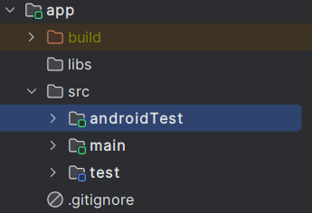
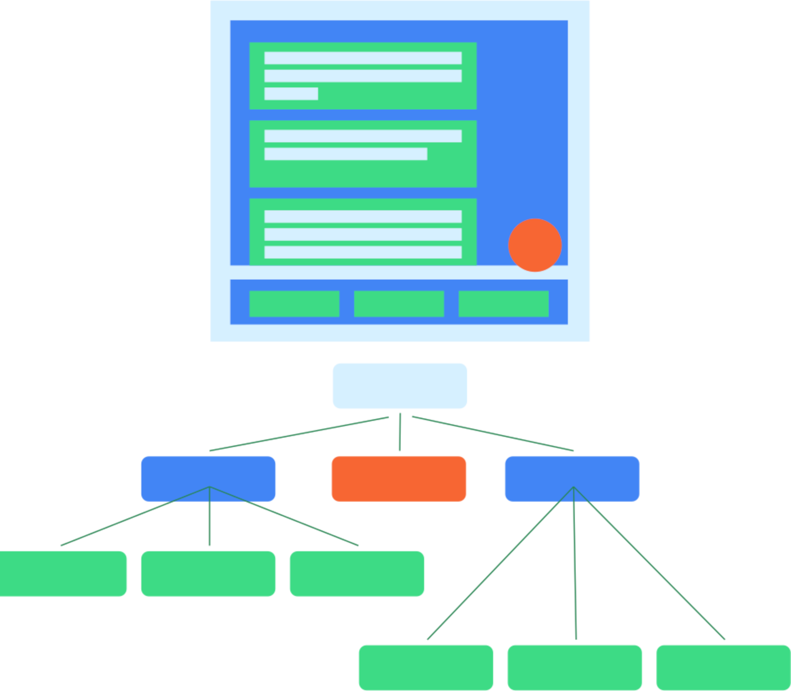
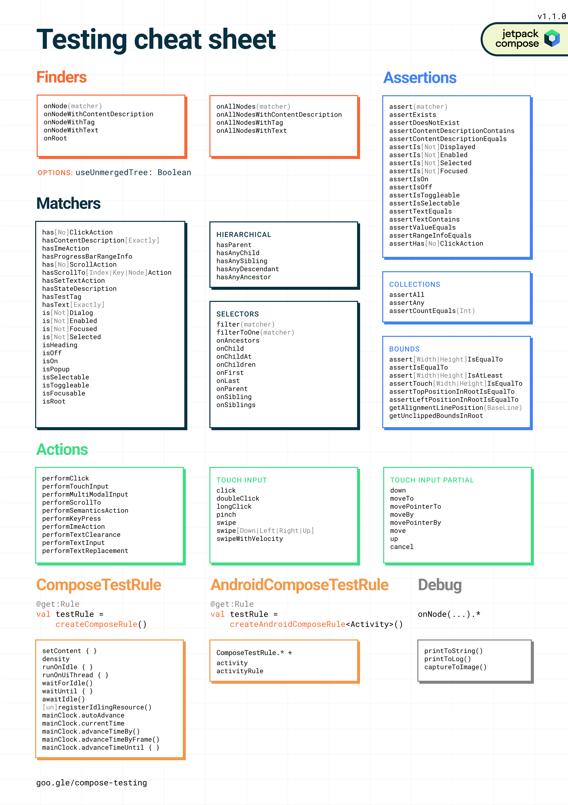

# Testes de interface

Testes são essenciais em qualquer app. Essa seção fará uma pequena introdução aos testes de interface com Jetpack Compose. É importante ressaltar que não teremos nada relacionado a testes unitários que envolvam lógicas de negócios, **ViewModels** ou coisas do tipo. Essa seção também não é sobre **o que testar**, pois cada app e UI têm suas particularidades.

## Local dos testes

Como testes de interface do Compose são **testes instrumentados**, eles ficam localizados na pasta **androidTest**. Também por esse motivo, **os testes dependem de um emulador ou dispositivo físico para rodarem**.



## Semântica

Os testes de UI no Compose usam **semântica** para interagir com a hierarquia da UI. A semântica, como o nome indica, dá significado a uma parte da UI. Uma "parte da UI" (ou elemento) pode significar qualquer coisa, desde um único Composable até uma tela inteira. A **árvore semântica** é gerada junto com a hierarquia da UI e a descreve. A estrutura semântica é usada principalmente para acessibilidade, portanto os testes aproveitam as informações expostas pela semântica sobre a hierarquia da UI. Você decide o que e quanto expor.



A partir de um teste, podemos usar ```onRoot().printToLog()``` para mostrar a árvore semântica:

```composeTestRule.onRoot().printToLog("TAG")```

Por exemplo, temos o seguinte código:

```kotlin
MyButton {
    Text("Hello")
    Text("World")
}
```

Esse código imprime a seguinte saída:

```
Node #1 at (...)px
 |-Node #2 at (...)px
   Role = 'Button'
   Text = '[Hello, World]'
   Actions = [OnClick, GetTextLayoutResult]
   MergeDescendants = 'true'
```

Veja que os 2 textos foram mesclados. Alguns nós mesclam as informações semânticas de seus filhos. Por exemplo, um botão com dois elementos de texto mescla seus rótulos, como vimos acima. Se você precisar corresponder a um nó do que seria a árvore não mesclada, poderá definir ```useUnmergedTree``` como **true** no ```onNode``` (ou suas variações). Por exemplo:

```
composeTestRule
    .onNodeWithText(text = "Texto", useUnmergedTree = true)
    .assertIsNotEnabled()
```

Imprimir a árvore semântica do código anterior com ```composeTestRule.onRoot(useUnmergedTree = true).printToLog("TAG")``` geraria a seguinte saída:

```
Node #1 at (...)px
 |-Node #2 at (...)px
   OnClick = '...'
   MergeDescendants = 'true'
    |-Node #3 at (...)px
    | Text = '[Hello]'
    |-Node #5 at (...)px
      Text = '[World]'
```

## Dependências de teste

Para essa seção, vamos precisar das seguintes dependências no **build.gradle (app)**:

```kotlin
// Regras de teste e dependências transitivas
androidTestImplementation("androidx.compose.ui:ui-test-junit4")
// Necessária para usar createAndroidComposeRule(), mas não para createComposeRule()
debugImplementation("androidx.compose.ui:ui-test-manifest")
// Testes de navegação
androidTestImplementation("androidx.navigation:navigation-testing:$navigationVersion")
```

As duas primeiras geralmente vêm incluídas ao criar um novo projeto Compose, mas a de navegação precisa ser incluída manualmente. Ela será necessária para fazer alguns testes de navegação posteriormente.

## APIs de teste

Existem três maneiras principais de interagir com os elementos:

- **Localizadores** permitem selecionar um ou vários elementos (ou **nós na árvore semântica**) para fazer afirmações ou executar ações sobre eles.
- **Asserções** são usadas para verificar se os elementos existem ou possuem determinados atributos.
- **Ações** injetam eventos simulados do usuário nos elementos, como cliques ou outros gestos.

Abaixo nós temos uma imagem retirada da [documentação](https://developer.android.com/jetpack/compose/testing-cheatsheet) que demonstra bem as opções acima:



## Estrutura básica de um teste

Abaixo nós temos um código com uma estrutura básica de teste.

```kotlin
class MyComposeTest {

    @get:Rule
    val composeTestRule = createComposeRule()

    @Test
    fun myTest() {
        composeTestRule.setContent {
            MyAppTheme {
                HomeScreen(
                    uiState = fakeUiState,
                    // ...
                )
            }
        }

        composeTestRule.onNodeWithText("Continuar").performClick()

        composeTestRule.onNodeWithText("Bem-vindo").assertIsDisplayed()
    }
}
```

**composeTestRule.setContent(composable: @Composable () -> Unit)** nos fornece um escopo onde podemos chamar funções Composable, onde inserimos a função Composable que vamos testar. No entanto, **ele só pode ser usado uma vez em cada função de teste**. Não podemos definir 2 conteúdos com **composeTestRule.setContent()** por teste.

No código acima, temos um teste básico onde o texto "Continuar" é buscado no Composable da **HomeScreen** e um clique nele é simulado. Após isso, espera-se que um texto "Bem-vindo" seja exibido na tela. Lembrando que **MyAppTheme** não seria obrigatório nesse contexto de teste.

#### Modifier.semantics() e Modifier.testTag()

Normalmente, para encontrar um componente, você pode utilizar **localizadores** como **onNodeWithText()** ou **onNodeWithContentDescription()**, por exemplo, mas às vezes o componente/Composable que você está tentando encontrar não possui um elemento como **text** ou **contentDescription** na árvore semântica. Existe o ```Modifier.semantics { contentDescription = "Descrição" }``` que pode ser usado para fins de acessibilidade e também de testes, pois ele cria um **contentDescription** e podemos utilizar **onNodeWithContentDescription()** para localizar.

Uma outra forma seria utilizar **Modifier.testTag("TAG")** no Composable em questão e usar **onNodeWithTag()** no teste. Diferente do ```Modifier.semantics()```, esse Modifier é útil apenas para fins de testes, o que pode poluir seu código de produção se usado em exagero e quando não necessário.

#### Combinações de condições

Também podemos fazer algumas combinações para garantir o que queremos. Para isso podemos usar a forma ```composeTestRule.onNode()``` (ou **onAllNodes()**). Por exemplo, temos uma tela com um botão de ajuda, mas essa tela tem um **Button()** com um texto "Ajuda" e também um **Text()** com "Ajuda" em outra parte. Escrevemos o seguinte teste:

```composeTestRule.onNodeWithText("Ajuda").performClick()```

Ele falharia com uma mensagem de erro do tipo **"Expected exactly '1' node but found '2' nodes that satisfy..."**. Para garantir a asserção, poderíamos usar a combinação abaixo:

```
composeTestRule
    .onNode(hasText("Ajuda") and hasClickAction())
    .performClick()
```

Dessa forma, apenas o elemento que contém o texto "Ajuda" e possui uma ação de clique, ou seja, o **Button()**, será encontrado.

## Testando o app de rastreio de encomendas

Para essa seção, nós usaremos o app que criamos na seção anterior sobre [telas, ViewModels e navegação](../screens/screens). Como já fizemos a estrutura básica principal do app, é um bom ponto de partida. Nós testaremos a **HomeScreen** e também a navegação do app, isto é, o **AppNavHost**.

## Testando a HomeScreen

Como a **HomeScreen** não usa strings literais, mas strings do arquivo **strings.xml**, é necessário utilizar ```createAndroidComposeRule<Activity>()``` para ser capaz de obter strings de recursos. Vamos criar o primeiro teste básico que apenas testa se todos os dados estão sendo exibidos, inclusive os inseridos através da classe de estado:

```kotlin
class HomeScreenTest {

    @get:Rule
    val composeTestRule = createAndroidComposeRule<ComponentActivity>()

    private lateinit var tracker: String
    private lateinit var trackingCode: String
    private lateinit var cep: String
    private lateinit var track: String

    @Before
    fun setUp() {
        composeTestRule.activity.apply {
            tracker = getString(R.string.tracker)
            trackingCode = getString(R.string.tracking_code)
            cep = getString(R.string.cep)
            track = getString(R.string.track)
        }
    }

    @Test
    fun homeScreenIsDisplayedCorrectly() {
        val myCode = "AMZ123456789"
        val myCep = 123456
        composeTestRule.setContent {
            MyAppTheme {
                HomeContent(
                    uiState = HomeUiState(code = myCode, cep = myCep),
                    onUiEvent = {},
                    onNavigateToTracking = {}
                )
            }
        }

        composeTestRule.onNodeWithText(tracker).assertIsDisplayed()
        composeTestRule.onNodeWithText(trackingCode).assertIsDisplayed()
        composeTestRule.onNodeWithText(cep).assertIsDisplayed()
        composeTestRule.onNodeWithText(track).assertIsDisplayed()

        composeTestRule.onNodeWithText(myCode).assertIsDisplayed()
        composeTestRule.onNodeWithText(myCep.toString()).assertIsDisplayed()
    }
}
```

O método **setUp()** será chamado antes de cada teste. Ele é útil para fazer configurações iniciais que os métodos de testes precisam. No código acima, apenas inicializamos as strings que vamos usar ao longo dessa classe para facilitar.

Você deve ter notado que estamos testando a **HomeContent()** e não a **HomeScreen()**. A **HomeScreen()** tem uma dependência com **ViewModel**. Não é o caso do projeto que criamos, mas normalmente **ViewModels** possuem diversas dependências extras, como repositórios, use cases, entre outras. Ao isolar essas duas funções e ter uma função que depende apenas do estado, podemos testar facilmente como o conteúdo da tela reage a diferentes estados. Também não é o caso do projeto que criamos por fins de simplicidade, mas é comum que as telas possuam muitos dados. Testar o estado dela de acordo com os dados passados é bem útil. Como a **HomeContent()** só precisa do estado (**HomeUiState**), podemos passar os dados que quisermos para fins de testes.

Agora que já criamos e vemos um pouco da explicação do primeiro teste, vamos criar mais 2 testes básicos que verificam se o botão de rastrear está sendo ativado/desativado de acordo com os dados de rastreamento:

```kotlin
class HomeScreenTest {

    ...

    @Test
    fun whenTrackingDataIsNotEmpty_thenTrackButtonShouldBeEnabled() {
        composeTestRule.setContent {
            MyAppTheme {
                HomeContent(
                    uiState = HomeUiState(code = "AMZ123456", cep = 123456),
                    onUiEvent = {},
                    onNavigateToTracking = {}
                )
            }
        }

        composeTestRule.onNodeWithText(track).assertIsEnabled()
    }

    @Test
    fun whenTrackingDataIsEmpty_thenTrackButtonShouldBeDisabled() {
        composeTestRule.setContent {
            MyAppTheme {
                HomeContent(
                    uiState = HomeUiState(code = "", cep = -1),
                    onUiEvent = {},
                    onNavigateToTracking = {}
                )
            }
        }

        composeTestRule.onNodeWithText(track).assertIsNotEnabled()
    }
}
```

Mas e se quisermos simular inputs de texto nos 2 **TextFields** de **code** e **cep**? Da forma como está não funcionaria, pois o **onUiEvent** não altera nada e os dados não mudam. Como nossa classe de dados é simples, nós podemos criar um state diretamente no teste. Vamos criar mais 2 testes. Como definimos antes na **HomeScreen**, o **TextField** de **cep** só aceita números, então vamos testar se isso realmente está funcionando quando tentamos inserir outros caracteres. O outro teste é para verificar se o botão de rastrear é ativado/desativado de acordo com o input do usuário, pois definimos que se o **code** e **cep** estiverem vazios, ele deve ficar desativado.

```kotlin
class HomeScreenTest {

    ...

    @Test
    fun whenTypingNonNumberCharactersInTheCep_thenTextFieldShouldIgnore() {
        composeTestRule.setContent {
            MyAppTheme {
                var homeUiState: HomeUiState by remember { mutableStateOf(HomeUiState()) }
                HomeContent(
                    uiState = homeUiState,
                    onUiEvent = { event ->
                        homeUiState = when (event) {
                            is HomeUiEvent.CodeChanged -> homeUiState.copy(code = event.code)
                            is HomeUiEvent.CepChanged -> homeUiState.copy(cep = event.cep)
                        }
                    },
                    onNavigateToTracking = {}
                )
            }
        }

        val invalidCep1 = "abcdef"
        composeTestRule.onNodeWithText(cep).performTextInput(invalidCep1)
        composeTestRule.onNodeWithText(invalidCep1).assertIsNotDisplayed()

        val invalidCep2 = "-,.{}/@#"
        composeTestRule.onNodeWithText(cep).performTextInput(invalidCep2)
        composeTestRule.onNodeWithText(invalidCep2).assertIsNotDisplayed()

        val invalidCep3 = " "
        composeTestRule.onNodeWithText(cep).performTextInput(invalidCep3)
        composeTestRule.onNodeWithText(invalidCep3).assertIsNotDisplayed()

        val validCep1 = "1"
        composeTestRule.onNodeWithText(cep).performTextInput(validCep1)
        composeTestRule.onNodeWithText(validCep1).assertIsDisplayed()

        val validCep2 = "23456"
        composeTestRule.onNodeWithText(cep).performTextInput(validCep2)
        composeTestRule.onNodeWithText(validCep1 + validCep2).assertIsDisplayed()

        val validCep3 = "abc"
        composeTestRule.onNodeWithText(cep).performTextInput(validCep3)
        composeTestRule.onNodeWithText(validCep2 + validCep3).assertIsNotDisplayed()
        composeTestRule.onNodeWithText(validCep1 + validCep2).assertIsDisplayed()
    }

    @Test
    fun whenInsertCodeAndCep_thenEnableTrackButton() {
        composeTestRule.setContent {
            MyAppTheme {
                var homeUiState: HomeUiState by remember { mutableStateOf(HomeUiState()) }
                HomeContent(
                    uiState = homeUiState,
                    onUiEvent = { event ->
                        homeUiState = when (event) {
                            is HomeUiEvent.CodeChanged -> homeUiState.copy(code = event.code)
                            is HomeUiEvent.CepChanged -> homeUiState.copy(cep = event.cep)
                        }
                    },
                    onNavigateToTracking = {}
                )
            }
        }

        composeTestRule.onNodeWithText(track).assertIsNotEnabled()
        composeTestRule.onNodeWithText(trackingCode).performTextInput("AMZ123456")
        composeTestRule.onNodeWithText(track).assertIsNotEnabled()

        composeTestRule.onNodeWithText(cep).performTextInput("123456")
        composeTestRule.onNodeWithText(track).assertIsEnabled()

        composeTestRule.onNodeWithText(trackingCode).performTextReplacement("")
        composeTestRule.onNodeWithText(track).assertIsNotEnabled()
    }
}
```

Utilizamos ```var homeUiState: HomeUiState by remember { mutableStateOf(HomeUiState()) }``` para manter uma referência ao estado que podemos alterar posteriormente no **onUiEvent**. Para manipular os inputs, usamos as funções ```performTextInput()``` e ```performTextReplacement()```.

Para não se alongar demais, esses serão os únicos testes que vamos criar da **HomeScreen**. Abaixo você pode ver o código completo da classe.

<details>
  <summary>Ver código da HomeScreenTest</summary>

```kotlin
class HomeScreenTest {

    @get:Rule
    val composeTestRule = createAndroidComposeRule<ComponentActivity>()

    private lateinit var tracker: String
    private lateinit var trackingCode: String
    private lateinit var cep: String
    private lateinit var track: String

    @Before
    fun setUp() {
        composeTestRule.activity.apply {
            tracker = getString(R.string.tracker)
            trackingCode = getString(R.string.tracking_code)
            cep = getString(R.string.cep)
            track = getString(R.string.track)
        }
    }

    @Test
    fun homeScreenIsDisplayedCorrectly() {
        val myCode = "AMZ123456789"
        val myCep = 123456
        composeTestRule.setContent {
            MyAppTheme {
                HomeContent(
                    uiState = HomeUiState(code = myCode, cep = myCep),
                    onUiEvent = {},
                    onNavigateToTracking = {}
                )
            }
        }

        composeTestRule.onNodeWithText(tracker).assertIsDisplayed()
        composeTestRule.onNodeWithText(trackingCode).assertIsDisplayed()
        composeTestRule.onNodeWithText(cep).assertIsDisplayed()
        composeTestRule.onNodeWithText(track).assertIsDisplayed()

        composeTestRule.onNodeWithText(myCode).assertIsDisplayed()
        composeTestRule.onNodeWithText(myCep.toString()).assertIsDisplayed()
    }

    @Test
    fun whenTrackingDataIsNotEmpty_thenTrackButtonShouldBeEnabled() {
        composeTestRule.setContent {
            MyAppTheme {
                HomeContent(
                    uiState = HomeUiState(code = "AMZ123456", cep = 123456),
                    onUiEvent = {},
                    onNavigateToTracking = {}
                )
            }
        }

        composeTestRule.onNodeWithText(track).assertIsEnabled()
    }

    @Test
    fun whenTrackingDataIsEmpty_thenTrackButtonShouldBeDisabled() {
        composeTestRule.setContent {
            MyAppTheme {
                HomeContent(
                    uiState = HomeUiState(code = "", cep = -1),
                    onUiEvent = {},
                    onNavigateToTracking = {}
                )
            }
        }

        composeTestRule.onNodeWithText(track).assertIsNotEnabled()
    }

    @Test
    fun whenTypingNonNumberCharactersInTheCep_thenTextFieldShouldIgnore() {
        composeTestRule.setContent {
            MyAppTheme {
                var homeUiState: HomeUiState by remember { mutableStateOf(HomeUiState()) }
                HomeContent(
                    uiState = homeUiState,
                    onUiEvent = { event ->
                        homeUiState = when (event) {
                            is HomeUiEvent.CodeChanged -> homeUiState.copy(code = event.code)
                            is HomeUiEvent.CepChanged -> homeUiState.copy(cep = event.cep)
                        }
                    },
                    onNavigateToTracking = {}
                )
            }
        }

        val invalidCep1 = "abcdef"
        composeTestRule.onNodeWithText(cep).performTextInput(invalidCep1)
        composeTestRule.onNodeWithText(invalidCep1).assertIsNotDisplayed()

        val invalidCep2 = "-,.{}/@#"
        composeTestRule.onNodeWithText(cep).performTextInput(invalidCep2)
        composeTestRule.onNodeWithText(invalidCep2).assertIsNotDisplayed()

        val invalidCep3 = " "
        composeTestRule.onNodeWithText(cep).performTextInput(invalidCep3)
        composeTestRule.onNodeWithText(invalidCep3).assertIsNotDisplayed()

        val validCep1 = "1"
        composeTestRule.onNodeWithText(cep).performTextInput(validCep1)
        composeTestRule.onNodeWithText(validCep1).assertIsDisplayed()

        val validCep2 = "23456"
        composeTestRule.onNodeWithText(cep).performTextInput(validCep2)
        composeTestRule.onNodeWithText(validCep1 + validCep2).assertIsDisplayed()

        val validCep3 = "abc"
        composeTestRule.onNodeWithText(cep).performTextInput(validCep3)
        composeTestRule.onNodeWithText(validCep2 + validCep3).assertIsNotDisplayed()
        composeTestRule.onNodeWithText(validCep1 + validCep2).assertIsDisplayed()
    }

    @Test
    fun whenInsertCodeAndCep_thenEnableTrackButton() {
        composeTestRule.setContent {
            MyAppTheme {
                var homeUiState: HomeUiState by remember { mutableStateOf(HomeUiState()) }
                HomeContent(
                    uiState = homeUiState,
                    onUiEvent = { event ->
                        homeUiState = when (event) {
                            is HomeUiEvent.CodeChanged -> homeUiState.copy(code = event.code)
                            is HomeUiEvent.CepChanged -> homeUiState.copy(cep = event.cep)
                        }
                    },
                    onNavigateToTracking = {}
                )
            }
        }

        composeTestRule.onNodeWithText(track).assertIsNotEnabled()
        composeTestRule.onNodeWithText(trackingCode).performTextInput("AMZ123456")
        composeTestRule.onNodeWithText(track).assertIsNotEnabled()

        composeTestRule.onNodeWithText(cep).performTextInput("123456")
        composeTestRule.onNodeWithText(track).assertIsEnabled()

        composeTestRule.onNodeWithText(trackingCode).performTextReplacement("")
        composeTestRule.onNodeWithText(track).assertIsNotEnabled()
    }
}
```
</details>

## Testando a navegação do app

Vamos criar também 2 testes básicos para verificar se a navegação do app está funcionando corretamente. Veja o código completo da classe:

<details>
  <summary>Ver código da NavigationTest</summary>

```kotlin
class NavigationTest {

    @get:Rule
    val composeTestRule = createAndroidComposeRule<ComponentActivity>()
    private lateinit var navController: TestNavHostController

    @Before
    fun setUpAppNavHost() {
        composeTestRule.setContent {
            MyAppTheme {
                navController = TestNavHostController(LocalContext.current)
                navController.navigatorProvider.addNavigator(ComposeNavigator())
                AppNavHost(navController = navController)
            }
        }
    }

    @Test
    fun verifyStartDestination() {
        composeTestRule.onNodeWithText(getString(R.string.tracker)).assertIsDisplayed()
    }

    @Test
    fun whenClickOnTrackButton_thenShouldNavigateToTrackingScreen() {
        val currentRoute1 = navController.currentBackStackEntry?.destination?.route
        assertEquals(currentRoute1, Screen.HomeScreen.route)
        composeTestRule
            .onNodeWithText(getString(R.string.tracker))
            .assertIsDisplayed()

        composeTestRule
            .onNodeWithText(getString(R.string.tracking_code))
            .performTextInput("AMZ123456")
        composeTestRule
            .onNodeWithText(getString(R.string.cep))
            .performTextInput("123456789")
        composeTestRule
            .onNodeWithText(getString(R.string.track))
            .performClick()

        val currentRoute2 = navController.currentBackStackEntry?.destination?.route
        assertEquals(currentRoute2, Screen.TrackingScreen.route)
        composeTestRule
            .onNodeWithText(getString(R.string.tracking))
            .assertIsDisplayed()
    }

    private fun getString(resourceId: Int) = composeTestRule.activity.getString(resourceId)
}
```
</details>

No **setUpAppNavHost()** nós fazemos as configurações iniciais do nosso **AppNavHost**, criando um **NavHostController** de testes com **TestNavHostController**.

No primeiro teste, verificamos se o destino inicial é a **HomeScreen**, testando se um texto que apenas ela possui está sendo exibido. Já no segundo, checamos se a navegação para a **TrackingScreen** está ocorrendo normalmente, verificando a rota atual.

## Conclusão

Testes são essenciais e é muito importante saber como implementá-los. Essa seção focou apenas em dar uma pequena introdução e um ponto de partida sobre como os testes de interface funcionam no Compose. Como o projeto de app que criamos na seção anterior é bem simples, talvez não dê para ver uma grande utilidade nos testes feitos nessa seção, e alguns deles parecem de fato inúteis. No entanto, é possível perceber que com a estrutura que foi montada, os testes foram facilitados e pudemos ver isso na prática. É sempre importante pensar se o código que você está criando é fácil de testar.

O Compose facilita muito isso, pois podemos criar UIs isoladas e componentizadas com facilidade, além de possuir muitos recursos e métodos de fácil usabilidade que ajudam nos testes, como foi possível observar ao longo da seção.

Você pode ler mais sobre testes na documentação.

## :link: Conteúdos auxiliares:
- [Testing your Compose layout (documentação)](https://developer.android.com/jetpack/compose/testing)
- [Navigation with Compose - Testing the NavHost (documentação)](https://developer.android.com/jetpack/compose/navigation#testing-nav-host)
- [Testing in Jetpack Compose (codelab)](https://developer.android.com/codelabs/jetpack-compose-testing)